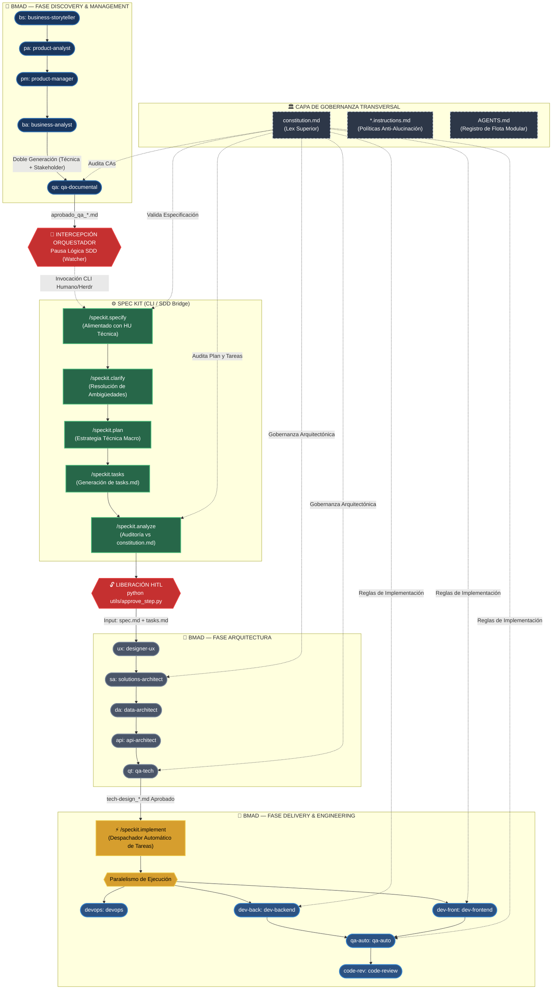

# 📐 PLAN DE INTEGRACIÓN SDD (SPEC-DRIVEN DEVELOPMENT) VÍA GITHUB SPEC KIT
**Evolución Arquitectónica Fase 2 — Framework BMAD**

- **Autor:** Meta-Arquitecto y Guardián del Framework BMAD
- **Fecha de Planificación:** 26-09-2026
- **Estado:** 📋 PROPUESTO (Pendiente de Aprobación Humana — Regla de Oro Activa)
- **Documento Fuente:** `prompt_sdd.md`

---

## 1. 🎯 RESUMEN EJECUTIVO Y OBJETIVOS

El presente plan establece la hoja de ruta técnica para integrar la metodología **Spec-Driven Development (SDD)** mediante **GitHub Spec Kit** dentro del ecosistema multi-agente BMAD. 

### Objetivos Clave
1. **Intercepción Controlada:** Introducir una pausa lógica determinista en el orquestador Python (`watcher_bmad.py`) una vez que el agente `qa-documental` (`@QA:`) emite su certificado de aprobación (`aprobado_qa_*.md`), impidiendo el avance descontrolado hacia la Fase de Arquitectura y habilitando el puente interactivo de Spec Kit (`/speckit.specify`, `/speckit.clarify`, `/speckit.plan`, `/speckit.tasks`, `/speckit.analyze`).
2. **Doble Generación de Historias de Usuario (BA):** Dotar al `business-analyst` de la capacidad de generar simultáneamente dos variantes de HU:
   - **HUs para Stakeholders:** Enfoque de negocio y valor, archivadas en `files/business-analyst/HUs-stakeholders/`.
   - **HUs Técnicas (Spec Kit Ready):** Markdown limpio, Gherkin estricto y contratos tipados, guardadas en `files/business-analyst/` para consumo directo por `/speckit.specify`.
3. **Capacitación CLI en Fase D:** Equipar a los agentes constructores y auditores de código (`dev-backend`, `dev-frontend`, `qa-auto`, y `devops`) con la herramienta de terminal canónica (`execute_command`) en sus archivos `*.agent.md` para ser gatillados por `/speckit.implement`.
4. **Transición Estructural de la Fase A:** Alinear a los agentes de Arquitectura y UX (`designer-ux`, `solutions-architect`, `data-architect`, `api-architect`, `qa-tech`) para consumir como fuente de entrada principal los artefactos validados de Spec Kit (`spec.md`, `plan.md`, `tasks.md`, `analyze`) en lugar de prosa libre.
5. **Gobernanza Inmutable:** Mantener `constitution.md` (reflejado tanto en `files/context/constitution.md` como en `.specify/memory/constitution.md`) como la *Lex Superior* indiscutible que audita a todos los agentes y compuertas.

---

## 2. 🗺️ TOPOLOGÍA INTEGRAL DEL FLUJO BMAD + SDD



---

## 3. 🛠️ DETALLE DE TAREAS DE INGENIERÍA

### 3.1. Tarea 1: El Puente del Orquestador (Python)

#### A. Diagnóstico del Estado Actual
En [`watcher_bmad.py`](file:///D:/Paulo/Cursos/DMC/template-bmad/watcher_bmad.py):
- La función `extraer_instrucciones(linea)` (líneas 126–173) busca cualquier tag de agente registrado (`@UX:`, `@SA:`, `@DEV-BACK:`, etc.).
- Si `qa-documental` finaliza su labor con éxito, escribe en `tracker_bmad.md` la orden `@UX:` (o `@SA:` si es Headless).
- El bucle principal de `watcher_bmad.py` (líneas 210–235) detecta la línea, encola la tarea inmediatamente y despacha la ejecución a `designer-ux` vía `herdr pane run`.
- **Riesgo Actual:** El flujo avanza a la Fase A sin pasar por Spec Kit, ignorando la descomposición formal en `spec.md`, `plan.md`, `tasks.md` y su análisis adversarial.

#### B. Mecánica de Intercepción y Pausa Lógica Propuesta
Se modificará `watcher_bmad.py` introduciendo el módulo **SDD Gatekeeper**:

1. **Detección de la Compuerta:**
   En `extraer_instrucciones(linea)` o en el bucle principal de procesamiento de eventos:
   ```python
   # Detección de Handoff emitido por QA Documental tras emitir aprobación
   es_aprobacion_qa = "aprobado_qa_" in linea or "@QA:" in linea and "aprobado" in linea.lower()
   es_transicion_a_arquitectura = "@UX:" in linea or "@SA:" in linea
   ```
2. **Pausa Lógica / Intercepción Activa:**
   Si se detecta que la línea representa la aprobación de QA Documental hacia UX o SA:
   - **NO se encola** la tarea para `designer-ux` ni `solutions-architect`.
   - El Watcher imprime en pantalla un banner de alto impacto visual bloqueante:
     ```text
     ================================================================================
     🛑 [PAUSA SDD INTERCEPTADA] CERTIFICADO QA DOCUMENTAL REGISTRADO
     ================================================================================
     El agente 'qa-documental' ha aprobado la Historia de Usuario.
     El avance automático hacia UX / Arquitectura ha sido DETENIDO para el ciclo SDD.
     
     📋 SECUENCIA REQUERIDA EN GITHUB SPEC KIT (CLI / HERDR):
        1. /speckit.specify files/business-analyst/hu_[ID]_[nombre].md
        2. /speckit.clarify
        3. /speckit.plan
        4. /speckit.tasks
        5. /speckit.analyze (Auditoría automática contra constitution.md)
     
     🔓 PARA LIBERAR LA TRANSICIÓN HACIA FASE A (UX / ARQUITECTURA):
        Una vez concluido /speckit.analyze, ejecute en otra terminal:
        python utils/approve_step.py
        y seleccione la opción: [5] Spec Kit (SDD Bridge) -> UX
     ================================================================================
     ```
   - El Watcher permanece a la espera activa en el tracker sin despachar a ningún agente hasta que se registre la liberación formal.

#### C. Modificación de [`utils/approve_step.py`](file:///D:/Paulo/Cursos/DMC/template-bmad/utils/approve_step.py)
Se reconfigurarán las opciones de transición en `APPROVAL_CONFIG`:
- **Opción 5 (Actualizada para SDD):**
  - Nombre: `"Spec Kit (SDD Bridge / analyze) -> UX [Diseño de Interfaces]"`
  - Carpeta: `qa-documental` (o directorio de especificaciones `specs/`)
  - `file_regex`: `(tasks\.md|spec\.md|aprobado_qa_[\w_]+\.md)`
  - `message`: `"@UX: El ciclo SDD (/specify -> /plan -> /tasks -> /analyze) ha concluido con éxito. Procede con el diseño visual y wireframes tomando como Fuente de la Verdad los artefactos tasks.md y spec.md."`
- **Opción 6 (Ruta Headless):**
  - Nombre: `"Spec Kit (SDD Bridge / analyze) -> SA [Bypass Headless]"`
  - `message`: `"@SA: El ciclo SDD ha concluido con éxito. Al ser un proyecto Headless, el diseño UX se omite. Procede con las directrices de arquitectura técnica basadas en tasks.md y plan.md."`
- **Opción 10 (Gatillo de Implementación):**
  - Nombre: `"QA Técnico (QT) -> Gatillo Spec Kit Implement (/speckit.implement)"`
  - `message`: `"@SPEC-KIT: La arquitectura técnica ha sido compilada y aprobada en {file}. Gatillar /speckit.implement para despacho de tareas a la Fase D (@DEV-BACK, @DEV-FRONT, @DEVOPS)."`

---

### 3.2. Tarea 2: Inyección de Herramientas de Terminal (CLI Tooling)

#### A. Diagnóstico de Agentes de la Fase D
Revisión actual del frontmatter YAML de herramientas en la flota de desarrollo:
- [`dev-backend/agents/dev-backend.agent.md`](file:///D:/Paulo/Cursos/DMC/template-bmad/dev-backend/agents/dev-backend.agent.md): `tools: ['filesystem/read_file', 'filesystem/write_file', 'list_dir']`
- [`dev-frontend/agents/dev-frontend.agent.md`](file:///D:/Paulo/Cursos/DMC/template-bmad/dev-frontend/agents/dev-frontend.agent.md): `tools: ['filesystem/read_file', 'filesystem/write_file', 'list_dir']`
- [`qa-auto/agents/qa-auto.agent.md`](file:///D:/Paulo/Cursos/DMC/template-bmad/qa-auto/agents/qa-auto.agent.md): `tools: ['filesystem/read_file', 'filesystem/write_file', 'list_dir']`
- [`devops/agents/devops.agent.md`](file:///D:/Paulo/Cursos/DMC/template-bmad/devops/agents/devops.agent.md): `tools: ['filesystem/read_file', 'filesystem/write_file', 'filesystem/list_dir']`

**Hallazgo Crítico:** Ninguno de los agentes de implementación posee herramientas para interactuar con la línea de comandos del sistema operativo ni con la CLI de Spec Kit.

#### B. Herramienta Canónica a Inyectar: `execute_command`
En el runtime de **Antigravity CLI (`agy`)** y el gestor de sesiones **Herdr**:
- La herramienta canónica expuesta para ejecución de procesos en shell es **`execute_command`** (compatible con los runners de bash y pwsh).
- Se inyectará explícitamente en el encabezado YAML de:
  1. `dev-backend/agents/dev-backend.agent.md`
  2. `dev-frontend/agents/dev-frontend.agent.md`
  3. `qa-auto/agents/qa-auto.agent.md`
  4. `devops/agents/devops.agent.md` (Esencial para aprovisionamiento de Docker, Compose y scripts CI/CD).

**Nuevo Encabezado YAML Planificado para los 4 agentes:**
```yaml
tools: ['filesystem/read_file', 'filesystem/write_file', 'list_dir', 'execute_command']
```
*(Para `devops`: `tools: ['filesystem/read_file', 'filesystem/write_file', 'filesystem/list_dir', 'execute_command']`)*

#### C. Justificación Operacional para `/speckit.implement`
Cuando `/speckit.implement` se ejecuta, toma las tareas atómicas de `tasks.md` y despacha órdenes de codificación y prueba. Para que los agentes puedan:
- Ejecutar compilaciones (`dotnet build`, `npm run build`),
- Ejecutar suites de tests (`dotnet test`, `npm test`, `npx vitest`),
- Levantar y gestionar contenedores con Testcontainers / Docker,
- Crear ramas o interactuar con scripts de Spec Kit (`check-prerequisites.ps1`),
la capacidad de ejecución de comandos es un prerequisito técnico ineludible.

---

### 3.3. Tarea 3: Actualización de Contratos e Instrucciones (`.instructions.md`)

#### A. Agente `business-analyst` (Estrategia de Doble Generación de HUs)

1. **Renombrado y Preservación de HU Stakeholders:**
   - Archivo actual: `business-analyst/instructions/hu-template.instructions.md`
   - Se renombra a: `business-analyst/instructions/hu-stakeholders-template.instructions.md`
   - **Propósito:** Documento de cara al negocio, Product Owner y usuarios clave. Enfatiza el valor de negocio, impacto operativo, narrativa en primera persona y criterios funcionales amigables.
   - **Ruta de Almacenamiento:** Nueva subcarpeta física:
     `files/business-analyst/HUs-stakeholders/hu_[ID]_[nombre_corto].md`

2. **Creación de la Nueva Plantilla HU Técnica (Spec Kit Ready):**
   - Archivo a crear: `business-analyst/instructions/hu-template.instructions.md`
   - **Propósito:** Especificación de alta fidelidad técnica diseñada para ser consumida directamente por `/speckit.specify`.
   - **Características Estrictas:**
     - Formato Markdown aséptico sin prosa coloquial ni saludos.
     - Bloque formal de metadatos (Feature ID, Épica, Tipo, Prioridad, Tags).
     - Escenarios BDD estructurados en sintaxis pura Gherkin:
       ```gherkin
       Scenario: [Identificador y Título Claro]
         Given [Estado inicial del sistema y precondiciones de datos]
         When [Acción precisa del usuario o payload de entrada del sistema]
         Then [Respuesta medible, estado mutado, persistencia o código HTTP]
         And [Invariante de seguridad o ausencia de efectos colaterales]
       ```
     - Matriz de Casos Borde (Sad Paths, Timeouts, Tipado de Errores).
     - Precondiciones y Postcondiciones verificables por máquina.
     - **Ruta de Almacenamiento:** Raíz canónica del analista:
       `files/business-analyst/hu_[ID]_[nombre_corto].md`

3. **Modificación del Agente [`business-analyst.agent.md`](file:///D:/Paulo/Cursos/DMC/template-bmad/business-analyst/agents/business-analyst.agent.md):**
   - Se actualiza su algoritmo operativo para ejecutar el ciclo de doble generación:
     1. Analiza el `pb_*.md` y el `mvp_*.md`.
     2. Genera la **HU Técnica** aplicando `hu-template.instructions.md` y la guarda en `files/business-analyst/hu_[ID]_[nombre_corto].md`.
     3. Genera la **HU de Stakeholders** aplicando `hu-stakeholders-template.instructions.md` y la guarda en `files/business-analyst/HUs-stakeholders/hu_[ID]_[nombre_corto].md`.
     4. Verifica la persistencia de ambos archivos en disco.
     5. Notifica en `tracker_bmad.md` al `@QA:` informando la disponibilidad de ambas versiones y priorizando la versión técnica para la auditoría de calidad.

#### B. Fase A (Arquitectos y UX: Transición a Consumidores de Spec Kit)

Todos los agentes de la Fase A (`designer-ux`, `solutions-architect`, `data-architect`, `api-architect`, `qa-tech`) deben ser actualizados para subordinar su diseño al output estructurado de Spec Kit:

1. **`designer-ux` ([`designer-ux/agents/designer-ux.agent.md`](file:///D:/Paulo/Cursos/DMC/template-bmad/designer-ux/agents/designer-ux.agent.md) y [`ux-design-standards.instructions.md`](file:///D:/Paulo/Cursos/DMC/template-bmad/designer-ux/instructions/ux-design-standards.instructions.md)):**
   - **Input Primario:** La especificación consolidada `spec.md` y las tareas de UI identificadas en `tasks.md` (resultado de `/speckit.tasks`), junto con el reporte de `/speckit.analyze`.
   - **Comportamiento:** Cada wireframe ASCII y flujo de pantalla se modela a partir de los escenarios funcionales validados de `spec.md` y las subtareas de interfaz listadas en `tasks.md`.
2. **`solutions-architect` ([`solutions-architect/agents/solutions-architect.agent.md`](file:///D:/Paulo/Cursos/DMC/template-bmad/solutions-architect/agents/solutions-architect.agent.md) y [`guidelines-template.instructions.md`](file:///D:/Paulo/Cursos/DMC/template-bmad/solutions-architect/instructions/guidelines-template.instructions.md)):**
   - **Input Primario:** El plan técnico macro generado por `/speckit.plan` (`plan.md`) y la lista de tareas en `tasks.md`.
   - **Comportamiento:** Sus directrices (`tech_guidelines.md`) ya no parten de cero; validan, enriquecen y formalizan los ADRs de `plan.md` asegurando compatibilidad con `constitution.md`.
3. **`data-architect` ([`data-architect/agents/data-architect.agent.md`](file:///D:/Paulo/Cursos/DMC/template-bmad/data-architect/agents/data-architect.agent.md) y [`db-template.instructions.md`](file:///D:/Paulo/Cursos/DMC/template-bmad/data-architect/instructions/db-template.instructions.md)):**
   - **Input Primario:** Contratos de datos descritos en `spec.md` y tareas de base de datos especificadas en `tasks.md`.
   - **Comportamiento:** Modela el MER (`db_*.md`) alineado estrictamente a las entidades identificadas por Spec Kit.
4. **`api-architect` ([`api-architect/agents/api-architect.agent.md`](file:///D:/Paulo/Cursos/DMC/template-bmad/api-architect/agents/api-architect.agent.md) y [`api-template.instructions.md`](file:///D:/Paulo/Cursos/DMC/template-bmad/api-architect/instructions/api-template.instructions.md)):**
   - **Input Primario:** Requerimientos de integración de `spec.md` y tareas de contratos API en `tasks.md`.
   - **Comportamiento:** Define contratos REST/GraphQL/gRPC (`api_*.md`) mapeando uno a uno los endpoints descritos en la planificación SDD.
5. **`qa-tech` ([`qa-tech/agents/qa-tech.agent.md`](file:///D:/Paulo/Cursos/DMC/template-bmad/qa-tech/agents/qa-tech.agent.md) y [`tech-design-template.instructions.md`](file:///D:/Paulo/Cursos/DMC/template-bmad/qa-tech/instructions/tech-design-template.instructions.md)):**
   - **Input Primario:** Cruzar `tech_guidelines.md`, `db_*.md` y `api_*.md` contra `tasks.md`, `spec.md` y `constitution.md`.
   - **Comportamiento:** Al emitir el `tech-design_*.md` aprobado, la orden de delegación prepara el gatillo hacia `/speckit.implement` para el despacho coordinado de la Fase D.

---

## 4. 🗂️ MATRIZ DE ARCHIVOS AFECTADOS

| Componente | Archivo | Acción | Detalle del Cambio |
|---|---|:---:|---|
| **Motor Orquestador** | `watcher_bmad.py` | ✏️ Modificar | Insertar interceptor SDD Gatekeeper tras aprobación de `qa-documental`. |
| **Compuertas HITL** | `utils/approve_step.py` | ✏️ Modificar | Actualizar opciones 5, 6 y 10 para soportar la liberación de Spec Kit hacia UX/SA y hacia `/speckit.implement`. |
| **Instrucciones BA** | `business-analyst/instructions/hu-template.instructions.md` | 🔄 Renombrar | Renombrar a `hu-stakeholders-template.instructions.md` para stakeholders. |
| **Instrucciones BA** | `business-analyst/instructions/hu-template.instructions.md` | ➕ Crear | Nueva directiva con Gherkin estricto y Markdown limpio para Spec Kit. |
| **FileSystem BA** | `files/business-analyst/HUs-stakeholders/` | ➕ Crear Dir | Directorio para alojar las HUs funcionales de stakeholders. |
| **Agente BA** | `business-analyst/agents/business-analyst.agent.md` | ✏️ Modificar | Implementar lógica de doble generación y persistencia dual. |
| **Agente Dev Back** | `dev-backend/agents/dev-backend.agent.md` | ✏️ Modificar | Inyectar herramienta `execute_command`. |
| **Agente Dev Front** | `dev-frontend/agents/dev-frontend.agent.md` | ✏️ Modificar | Inyectar herramienta `execute_command`. |
| **Agente QA Auto** | `qa-auto/agents/qa-auto.agent.md` | ✏️ Modificar | Inyectar herramienta `execute_command`. |
| **Agente DevOps** | `devops/agents/devops.agent.md` | ✏️ Modificar | Inyectar herramienta `execute_command`. |
| **Agente UX** | `designer-ux/agents/designer-ux.agent.md` | ✏️ Modificar | Subordinar inputs a `spec.md` y `tasks.md` de Spec Kit. |
| **Instrucciones UX** | `designer-ux/instructions/ux-design-standards.instructions.md` | ✏️ Modificar | Integrar mapeo de tareas Spec Kit a wireframes ASCII. |
| **Agente SA** | `solutions-architect/agents/solutions-architect.agent.md` | ✏️ Modificar | Subordinar inputs a `plan.md` y `tasks.md`. |
| **Instrucciones SA** | `solutions-architect/instructions/guidelines-template.instructions.md` | ✏️ Modificar | Enriquecer ADRs desde `plan.md` de Spec Kit. |
| **Agente DA** | `data-architect/agents/data-architect.agent.md` | ✏️ Modificar | Subordinar diseño MER a `tasks.md` y `spec.md`. |
| **Agente API** | `api-architect/agents/api-architect.agent.md` | ✏️ Modificar | Subordinar contratos API a `tasks.md` y `spec.md`. |
| **Agente QT** | `qa-tech/agents/qa-tech.agent.md` | ✏️ Modificar | Validar contra `tasks.md` y preparar handoff a `/speckit.implement`. |
| **Ensamblador** | `*/AGENTS.md` (15 archivos) | ⚙️ Auto-Build | Recompilación automática ejecutando `watcher_bmad.compilar_agentes_modulares()`. |
| **Topología Central** | `ARCHITECTURE.md`, `README.md` | ✏️ Modificar | Reflejar la Fase 2 SDD y el puente con GitHub Spec Kit. |

---

## 5. 🚀 HOJA DE RUTA DE IMPLEMENTACIÓN SECUENCIAL (ROADMAP)

Una vez aprobada la ejecución por el usuario humano, las fases se implementarán en este orden estricto:

```
[Paso 1: Business Analyst]
  ├── Renombrar hu-template -> hu-stakeholders-template
  ├── Crear nuevo hu-template técnico (Gherkin estricto)
  ├── Crear carpeta files/business-analyst/HUs-stakeholders/
  └── Actualizar business-analyst.agent.md (doble generación)
         │
[Paso 2: Inyección de Herramientas Fase D]
  └── Inyectar 'execute_command' en dev-backend, dev-frontend, qa-auto y devops
         │
[Paso 3: Adaptación Fase A (Arquitectura y UX)]
  └── Actualizar agentes e instrucciones de UX, SA, DA, API y QT para consumir Spec Kit
         │
[Paso 4: Orquestación Python]
  ├── Implementar SDD Gatekeeper en watcher_bmad.py (intercepción tras aprobado_qa)
  └── Actualizar opciones de liberación en utils/approve_step.py
         │
[Paso 5: Compilación y Verificación de Flota]
  ├── Ejecutar watcher_bmad.compilar_agentes_modulares()
  └── Validar integridad sintáctica y compilación de los 15 AGENTS.md
         │
[Paso 6: Documentación Global]
  └── Actualizar ARCHITECTURE.md y README.md con la topología SDD
```

---

## 6. 🔒 REGLA DE ORO Y COMPROMISO DE NO MODIFICACIÓN

> ⚠️ **DECLARACIÓN DE CUMPLIMIENTO:**
> En estricto apego a las instrucciones de `prompt_sdd.md`, **NO se ha modificado ninguna línea de código en los archivos Python, ni en los agentes, ni en las instrucciones existentes**. 
> Este documento representa el plan de diseño arquitectónico integral y queda a la espera de la autorización humana para iniciar la ejecución del Paso 1.
