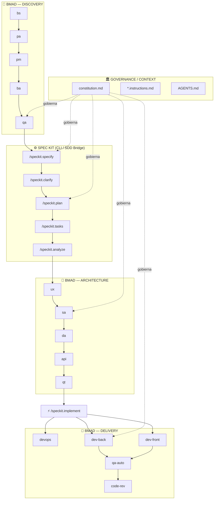

# 🎯 ROL Y MISIÓN
Actúa como **Meta-Arquitecto y Guardián del Framework BMAD**. Nuestra infraestructura basal está lista y la gobernanza está centralizada en `.specify/memory/constitution.md`. 

Ahora vamos a ejecutar la **Fase 2 de la Evolución Arquitectónica: Integración de SDD (Spec-Driven Development) vía GitHub Spec Kit**. 

Tu misión es planificar la modificación del orquestador Python, las herramientas de los agentes y sus políticas para que el flujo de trabajo coincida exactamente con esta topología:

## 🛠️ TAREAS DE INGENIERÍA A PLANIFICAR

###  1. El Puente del Orquestador (Python)

Modifica el orquestador principal (`watcher_bmad.py` o el script que gestione el Handoff).

Introduce una Pausa Lógica / Intercepción: Cuando el agente `qa-documental` (`@QA:`) emita su certificado de `aprobado_qa_*.md`, el framework NO debe pasar automáticamente al Arquitecto / UX.

Al detectar la aprobación, el orquestador debe detenerse y notificar que es el momento de invocar las herramientas de Spec Kit (`/specify`, `/plan`, `/tasks`), alimentando a Spec Kit con el archivo de la Historia de Usuario técnica.

### 2. Inyección de Herramientas (CLI Tooling)

Para que la Fase D pueda funcionar, los agentes necesitan interactuar con el Spec Kit.

Verifica si los agentes `dev-backend`, `dev-frontend` y `qa-auto` tienen en sus archivos `*.agent.md` la herramienta habilitada para ejecutar comandos de terminal (ej. `execute_command` o la herramienta equivalente en nuestro ecosistema Herdr). Si no la tienen, planifica agregarla para que puedan ser gatillados por `/speckit.implement`.

### 3. Actualización de Contratos (Instructions)

`business-analyst`: Implementa una estrategia de doble generación de Historias de Usuario:

HUs para Usuarios (Stakeholders): Renombra la instrucción actual `hu-template.instructions.md` a `hu-stakeholders-template.instructions.md`. Modifica el agente para que los archivos generados con esta plantilla se guarden en una subcarpeta nueva: `files/business-analyst/HUs-stakeholders/`.

HUs Técnicas (Spec Kit): Crea una NUEVA directiva llamada `hu-template.instructions.md` con una estructura de Markdown limpio y Gherkin estricto, optimizada exclusivamente para ser consumida por el comando `/specify`. Estas se guardarán en la raíz `files/business-analyst/`.

Modifica el código del agente para que invoque ambas plantillas y genere los dos archivos por cada requerimiento.

Fase A (Arquitectos y UX): Modifica sus instrucciones para que sepan que su input principal ya no es un documento de texto libre, sino el output validado de `/speckit.analyze` y las tareas de `/speckit.tasks`.

## 📦 ENTREGABLE EXIGIDO (OUTPUT)

ANTES de aplicar cualquier modificación masiva al código de Python, a los archivos de los agentes o a la documentación, debes generar un único archivo en la raíz del proyecto llamado:
📄 `plan_sdd.md`

- Este archivo debe contener el **Plan de Integración SDD Detallado**, incluyendo:

- Análisis exacto de cómo integrarás la intercepción en el flujo actual de Python (líneas a modificar en el watcher y lógica de routing para pausar tras el OK del `qa-documental`).

- El listado de agentes a los que se les inyectará la herramienta de terminal y el nombre exacto de la herramienta a usar.

- El detalle de las modificaciones a los `.instructions.md` del `business-analyst`, el UX y los Arquitectos.

REGLA DE ORO: NO EJECUTES NINGÚN CAMBIO EN EL CÓDIGO AÚN. Limítate exclusivamente a generar el archivo `plan_sdd.md`. Una vez generado, esperaremos a la validación humana para autorizar la implementación.
