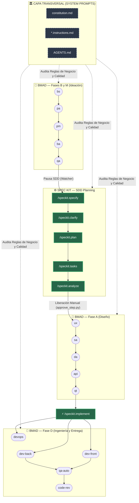

# 🎯 ROL Y MISIÓN
Actúa como **Meta-Arquitecto y Guardián del Framework BMAD**. La mutación de código, inyección de herramientas CLI y reestructuración de agentes para la Fase 2 (SDD vía Spec Kit) ha concluido con éxito en el FileSystem.

Tu misión final es sincronizar la documentación global de la raíz del repositorio para que refleje con exactitud la nueva topología, la mecánica de intercepción y la gobernanza transversal.

---

# 🛠️ TAREAS DE DOCUMENTACIÓN A EJECUTAR

### 1. Refactor de `ARCHITECTURE.md`
Reescribe las secciones desactualizadas de este documento. Debes inyectar y explicar los siguientes conceptos clave:
- **Gobernanza Transversal (Lex Superior):** Explica que `.specify/memory/constitution.md` y las políticas `.instructions.md` actúan como *System Prompts* que auditan todas las fases.
- **Estrategia Dual-Output (Fase M):** Documenta que el `@BA` ahora genera HUs para stakeholders (en `files/business-analyst/HUs-stakeholders/`) y HUs técnicas en Gherkin estricto para la máquina.
- **SDD Gatekeeper (El Puente Spec Kit):** Explica la intercepción lógica del `watcher_bmad.py` tras el certificado del `@QA:` y cómo el CLI de Spec Kit toma el relevo (`/specify`, `/plan`, `/tasks`, `/analyze`).
- **Inyección del Diagrama Maestro:** Agrega este diagrama de flujo con esta topología exacta:

1. Refactor de README.md
Actualiza la sección de "Cómo usar el framework" o "Flujo de Ejecución".

Añade un paso explícito explicando que la consola se pausará después de que el QA Documental apruebe, indicando al usuario humano que debe ejecutar los comandos CLI de specify y luego usar python utils/approve_step.py para reanudar el orquestador hacia la Fase A.

Menciona que los agentes de desarrollo ahora tienen capacidad de ejecución en terminal (execute_command).

3. Recompilación del AGENTS.md
Si no lo has hecho como parte de la ejecución del plan, ejecuta el script o lógica correspondiente (ej. watcher_bmad.compilar_agentes_modulares()) para que el AGENTS.md de la raíz refleje las nuevas herramientas (execute_command) y descripciones actualizadas de todos los agentes.

📦 ENTREGABLE EXIGIDO (OUTPUT)
Modifica los archivos ARCHITECTURE.md, GUIDE.md, SETUP.md, DIAGRAMAS.md y README.md directamente usando tus herramientas de escritura.

Compila el nuevo AGENTS.md.

Imprime un reporte conciso confirmando que la documentación refleja al 100% la Fase 2 (SDD).
