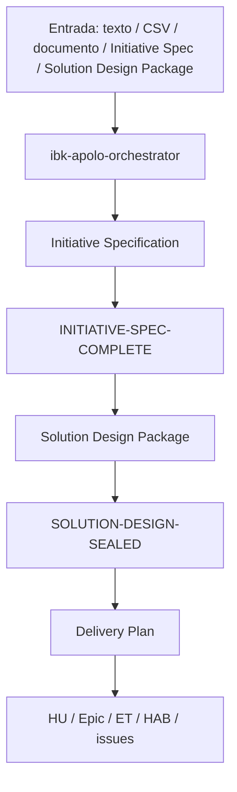

# ibk-apolo-plugin — Arquitectura

> Este documento describe cómo se organiza el plugin de definición de producto y cómo avanza una iniciativa a través de las tres etapas del ciclo de vida.

## 1. Visión general

El plugin está diseñado para guiar una iniciativa desde la definición inicial hasta la preparación para desarrollo y carga a Jira. La orquestación se realiza por un agente de enrutamiento que detecta la etapa y delega el trabajo a un subagente especializado. Cada etapa produce un artefacto con una validación explícita de handoff antes de avanzar.

## 2. Componentes y responsabilidades

| Componente | Responsabilidad | Entrada | Salida |
|---|---|---|---|
| `ibk-apolo-orchestrator` | Detecta la etapa y enruta a un subagente. | iniciativa o artefacto de etapa | delegación a subagente |
| `ibk-apolo-business-analyst` | Genera y valida la Initiative Specification de la iniciativa. | texto, CSV, transcript, documento | `initiative-spec_v1.x` con `INITIATIVE-SPEC-COMPLETE` |
| `ibk-apolo-system-design-architect` | Enriquecer la Initiative Specification, resolver huecos y generar el Solution Design Package con diagramas y diseño. | Initiative Specification validada | carpeta `solution-design-package_v2.x` con `SOLUTION-DESIGN-SEALED` |
| `ibk-apolo-tech-delivery-planner` | Convierte el Solution Design Package sellado en un breakdown listo para Jira (Delivery Plan / Delivery Backlog). | Solution Design Package sellado | epic, HU, ET, HAB y issues |
| `ibk-apolo-handoff-validator` | Revisa entrada y salida del artefacto según contrato. | artefacto o bundle | `PASS` / `WARN` / `BLOCK` |
| Skills de integración | Conectan Jira, Figma, GitHub y extracción de documentos. | contexto y credenciales | datos y artefactos técnicos |

## 3. Flujo end-to-end

1. El usuario inicia una iniciativa o entrega un artefacto de una etapa.
2. El orquestador detecta la etapa e invoca el subagente correspondiente.
3. El subagente valida la entrada con el handoff validator antes de trabajar.
4. Cada etapa produce un artefacto sellado: `INITIATIVE-SPEC-COMPLETE` o `SOLUTION-DESIGN-SEALED`.
5. Si la salida cumple la contract, el usuario puede avanzar a la siguiente etapa.
6. En Delivery Plan se crea la descomposición técnica y se cargan los issues a Jira (Delivery Backlog) con validación adicional.

## 4. Estado y fuente de verdad

| Dato | Ubicación | Escribe | Lee |
|---|---|---|---|
| Configuración del plugin | `plugin.json`, `manifest.yaml` | propietario del repo | orquestador y subagentes |
| Reglas de gobernanza | `instructions/*.instructions.md` | equipo/autor | todos los agentes |
| Estado de etapa | artefactos Initiative Specification/Solution Design Package generados por cada etapa | subagente | siguiente subagente |
| Contratos de handoff | `skills/ibk-apolo-handoff-validator/references/handoff-contracts.yaml` | validador | agentes del ciclo |
| Integración con Jira | `skills/ibk-apolo-jira-cloud-api` | subagente de Delivery Plan | planner y proceso |
| Integración con Figma | `skills/ibk-apolo-figma-api` / `ibk-apolo-figma-design-builder` | diseño | Solution Design Package |
| Base de conocimiento | `~/.apolo/config.yaml` | skill de GitHub/KB | Initiative Specification y Solution Design Package |

## 5. Decisiones e invariantes

| Invariante | Razón | Cómo verificar |
|---|---|---|
| El orquestador nunca hace el trabajo de la etapa | Mantiene la separación de responsabilidades | Revisar que solo delega con el `agent` tool |
| Cada etapa debe validar entrada y salida | Evita handoff inválidos o incompletos | Ejecutar `ibk-apolo-handoff-validator` |
| No se usan MCP | El plugin está orientado a REST y conexiones externas por entorno | Revisar `manifest.yaml` y la documentación del plugin |
| Las credenciales no se guardan en archivos del repositorio | Seguridad y portabilidad para usuarios no técnicos | Verificar uso de variables de entorno |
| El avance solo ocurre si el estado es válido | Evita saltar etapas o cargar artefactos incompletos | Confirmar `INITIATIVE-SPEC-COMPLETE` o `SOLUTION-DESIGN-SEALED` |

## 7. Límites y stop conditions

- 🛑 Si no hay entrada clara ni artefacto válido, el agente no fuerza una etapa arbitraria.
- 🛑 Si la Initiative Specification o el Solution Design Package no cumple el contrato, la etapa se detiene y se informa la causa.
- 🛑 Si la acción implica escritura destructiva en Jira/Figma o archivos, se exige confirmación explícita.
- ❌ Fuera de alcance: implementación técnica real del producto, cambios en código de servicio y MCS no habilitado.

## 10. Referencias
- Portada → [`README.md`](./README.md)
- Reglas de gobernanza → [`instructions/ibk-apolo-governance-compliance.instructions.md`](./instructions/ibk-apolo-governance-compliance.instructions.md)
- Handoff → [`skills/ibk-apolo-handoff-validator/SKILL.md`](./skills/ibk-apolo-handoff-validator/SKILL.md)
- Orquestador → [`agents/ibk-apolo-orchestrator.agent.md`](./agents/ibk-apolo-orchestrator.agent.md)
