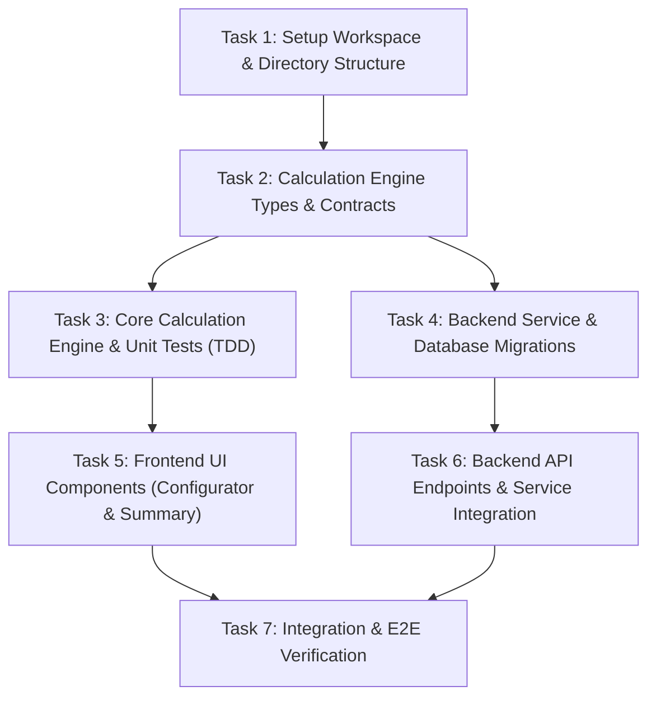

# Task Breakdown: 002-HU_motor_configuracion_calculo_cotizaciones

**Feature Branch**: `feat/001-HU_configurador_y_calculo_cotizaciones` | **Spec**: [001-HU_configurador_y_calculo_cotizaciones.md](file:///D:/Paulo/Cursos/DMC/template-bmad/files/business-analyst/001-HU_configurador_y_calculo_cotizaciones.md)  
**Plan**: [plan.md](file:///D:/Paulo/Cursos/DMC/template-bmad/specs/002-HU_motor_configuracion_calculo_cotizaciones/plan.md) | **Data Model**: [data-model.md](file:///D:/Paulo/Cursos/DMC/template-bmad/specs/002-HU_motor_configuracion_calculo_cotizaciones/data-model.md)

---

## Task Summary & Dependencies

---

## Detailed Tasks List

### Phase 1: Setup & Core Infrastructure

#### [ ] Task 1: Setup Workspace & Directory Structure
- **Objective**: Create the baseline directory structure according to BMAD standards and initialize `app/frontend` and `app/backend` packages.
- **Files**:
  - `app/frontend/package.json`
  - `app/backend/package.json`
  - `app/frontend/tsconfig.json`
  - `app/backend/tsconfig.json`
- **Steps**:
  1. Initialize `app/frontend` as a React + TypeScript project with TailwindCSS and Lucide Icons.
  2. Initialize `app/backend` as a Node.js + Express + TypeScript project.
  3. Ensure root folder configurations comply with project rules.

---

### Phase 2: Engine Development (Frontend TDD)

#### [ ] Task 2: Calculation Engine Types & Contracts
- **Objective**: Define immutable TypeScript types and validation schemas for items, quotes, and calculation results.
- **Files**:
  - `app/frontend/src/types/quote.ts`
- **Steps**:
  1. Define `ServiceItem`, `QuoteItem`, and `CalculationResult` interfaces.
  2. Define error types for invalid quantity ($\le 0$) and empty selection.

#### [ ] Task 3: Core Calculation Engine & Unit Tests (TDD)
- **Objective**: Implement pure functional calculation engine with <1ms performance and 100% test coverage.
- **Files**:
  - `app/frontend/src/engine/calculationEngine.ts`
  - `app/frontend/src/engine/validators.ts`
  - `app/frontend/tests/engine/calculationEngine.test.ts`
- **Steps**:
  1. Create unit tests for subtotal calculations, quantities, discounts/taxes, and error states.
  2. Implement pure functional calculation logic in `calculationEngine.ts`.
  3. Verify execution time is $<1\text{ms}$ per calculation step.

---

### Phase 3: Backend & Database

#### [ ] Task 4: Database Migrations & Models
- **Objective**: Set up PostgreSQL schema for catalog services and persisted quotes.
- **Files**:
  - `app/backend/migrations/001_init.sql`
  - `app/backend/src/models/catalog.ts`
  - `app/backend/src/models/quote.ts`
- **Steps**:
  1. Create tables: `services_catalog`, `quotes`, `quote_items`.
  2. Populate `services_catalog` with default service options.

#### [ ] Task 5: Backend API Endpoints & Controllers
- **Objective**: Implement REST API for catalog retrieval and quote saving/generation.
- **Files**:
  - `app/backend/src/controllers/catalogController.ts`
  - `app/backend/src/controllers/quoteController.ts`
  - `app/backend/src/routes/api.ts`
  - `app/backend/tests/integration/quoteApi.test.ts`
- **Steps**:
  1. Implement GET `/api/v1/services` to return catalog items.
  2. Implement POST `/api/v1/quotes` to calculate server-side validation and persist quotes.

---

### Phase 4: Frontend UI Development

#### [ ] Task 6: Frontend UI Components
- **Objective**: Build responsive 2-panel interface (Configurator Panel and Quote Summary Card).
- **Files**:
  - `app/frontend/src/components/ConfiguratorPanel.tsx`
  - `app/frontend/src/components/ServiceItemCard.tsx`
  - `app/frontend/src/components/QuoteSummaryCard.tsx`
  - `app/frontend/src/App.tsx`
- **Steps**:
  1. Implement `ServiceItemCard` with dynamic quantity selectors.
  2. Implement `QuoteSummaryCard` displaying live subtotal, tax, and total.
  3. Disable "Generar PDF" button dynamically when quote state is invalid or empty.

---

### Phase 5: Integration & Verification

#### [ ] Task 7: Integration & E2E Verification
- **Objective**: Connect frontend with backend API and verify non-functional performance requirements.
- **Files**:
  - `app/frontend/src/services/api.ts`
- **Steps**:
  1. Wire UI to fetch catalog from backend REST endpoint with local fallback cache.
  2. Run end-to-end tests and verify $<1\text{ms}$ calculation reactivity in UI.
