# Backend Architecture Document

## 1. Diagrama de contexto

Primero responde:

> ¿Quién consume el backend y con qué sistemas se integra?

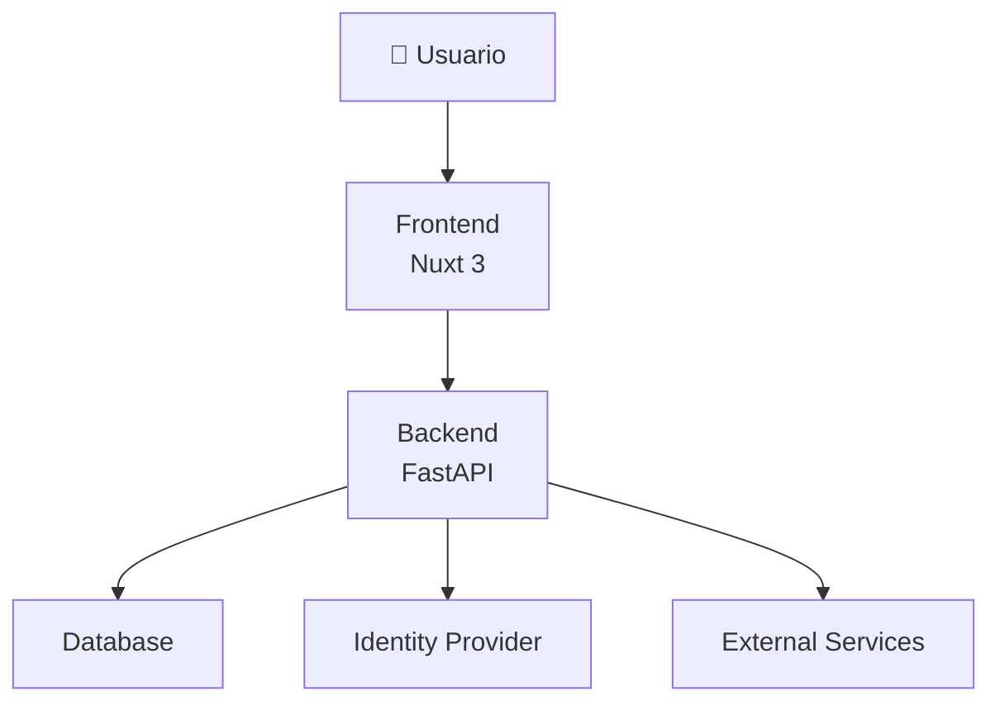

Este es equivalente al **Context Diagram** del frontend.

---

# 2. Diagrama de contenedores

Aquí muestras las grandes piezas del backend.

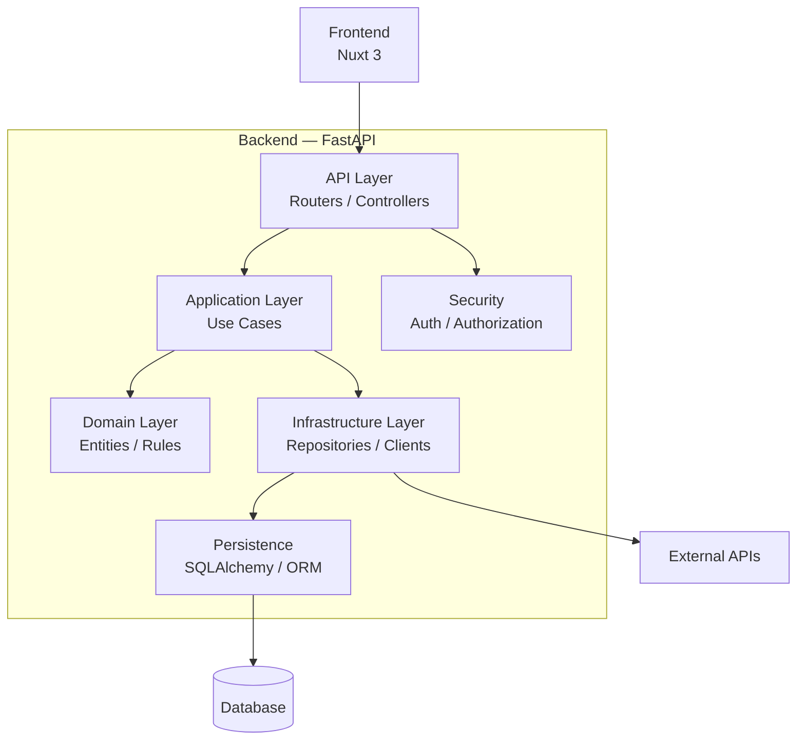

Este probablemente será **uno de los diagramas principales de tu arquitectura**.

---

# 3. Arquitectura por capas

Si utilizas Clean Architecture, puedes representar explícitamente las dependencias.

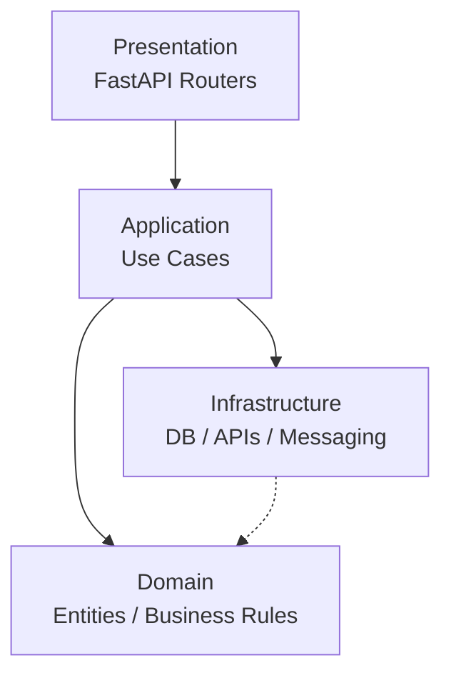

La regla arquitectónica importante sería:

```text
Presentation
      ↓
Application
      ↓
Domain

Infrastructure → implementa interfaces definidas por Application/Domain
```

Es decir, el dominio **no debería depender de FastAPI, SQLAlchemy ni de una base de datos concreta**.

---

# 4. Diagrama de módulos

Muestra cómo está organizado el código.

Por ejemplo:

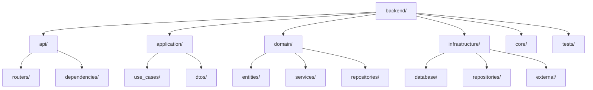

Esto después se puede reflejar en la estructura física:

```text
backend/
├── api/
│   ├── routers/
│   └── dependencies/
│
├── application/
│   ├── use_cases/
│   └── dtos/
│
├── domain/
│   ├── entities/
│   ├── services/
│   └── repositories/
│
├── infrastructure/
│   ├── database/
│   ├── repositories/
│   └── external/
│
├── core/
└── tests/
```

---

# 5. Diagrama de componentes

Este es para profundizar en un módulo.

Por ejemplo, **Clientes**:

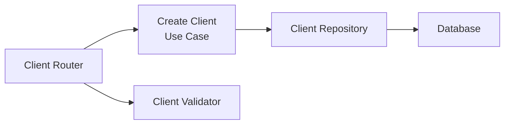

Aquí el arquitecto puede explicar claramente:

```text
HTTP Request
     ↓
Router
     ↓
Validation
     ↓
Use Case
     ↓
Repository
     ↓
Database
```

---

# 6. Diagrama de secuencia

Este es **fundamental** para backend.

Por ejemplo:

### Registrar cliente

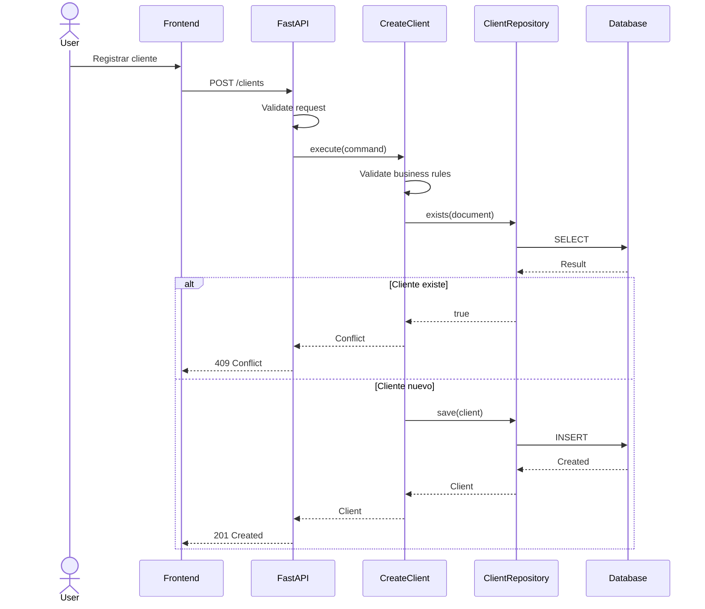

Este tipo de diagrama documenta **el comportamiento real**.

---

# 7. Diagrama de flujo de una petición

Para explicar el pipeline general:

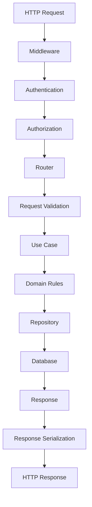

Este diagrama es excelente para explicar **qué ocurre con una request desde que entra hasta que sale**.

---

# 8. Diagrama de autenticación

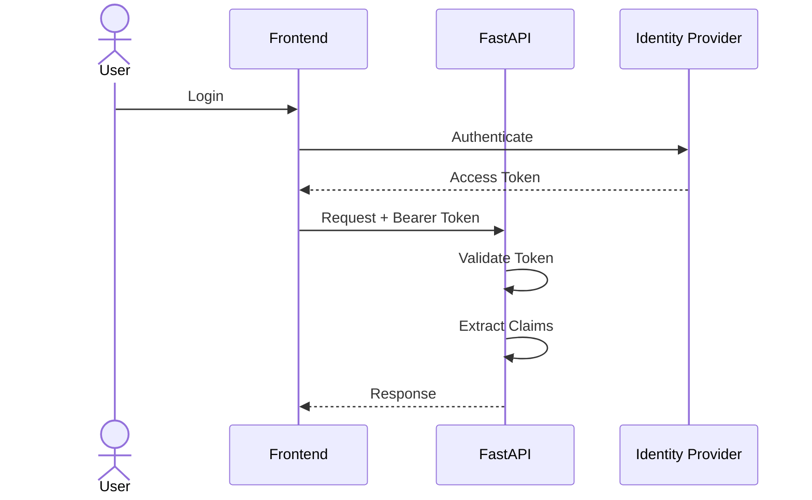

---

# 9. Diagrama de autorización

Autenticación y autorización conviene documentarlas por separado.

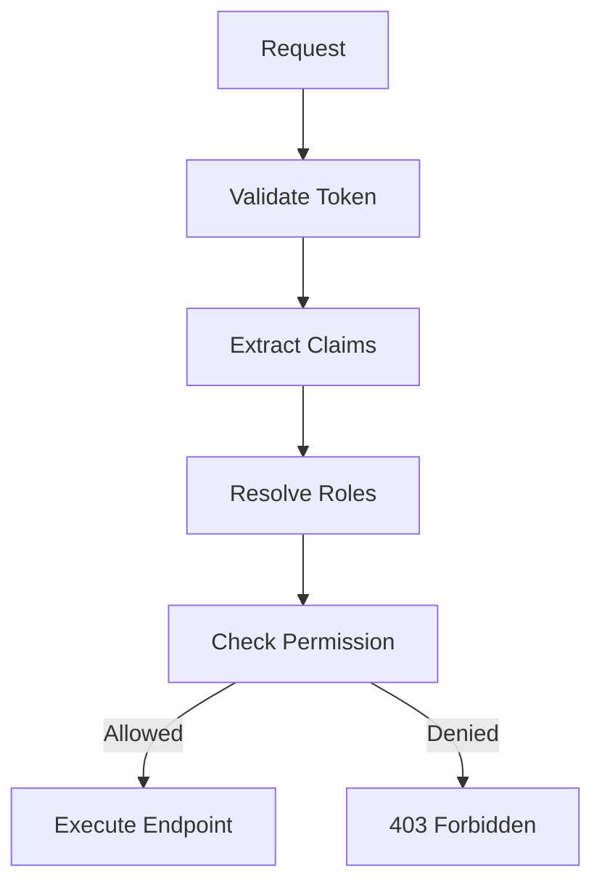

Por ejemplo:

```text
USER
 └── ROLE_MANAGER
       ├── CLIENT_READ
       ├── CLIENT_CREATE
       └── CLIENT_UPDATE
```

---

# 10. Diagrama de persistencia

Muestra cómo se conecta la aplicación con la base de datos.

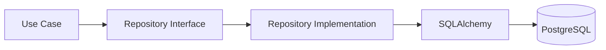

Aquí queda muy clara la separación:

```text
Domain/Application
       │
       ▼
Repository Interface
       │
       ▼
Repository Implementation
       │
       ▼
SQLAlchemy
       │
       ▼
Database
```

---

# 11. Diagrama entidad-relación

Este ya es un diagrama de **datos**, no propiamente de componentes.

Por ejemplo:

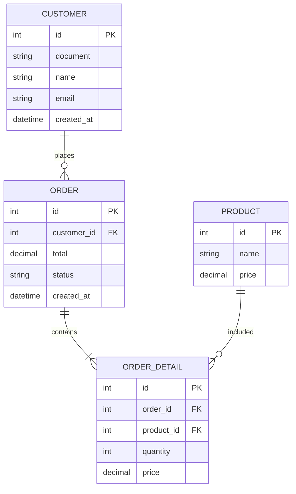

Para sistemas grandes, recomiendo separar:

* modelo lógico
* modelo físico
* ERD por dominio

en lugar de crear un único diagrama gigantesco.

---

# 12. Diagrama de transacciones

Muy importante cuando tienes operaciones que modifican varias entidades.

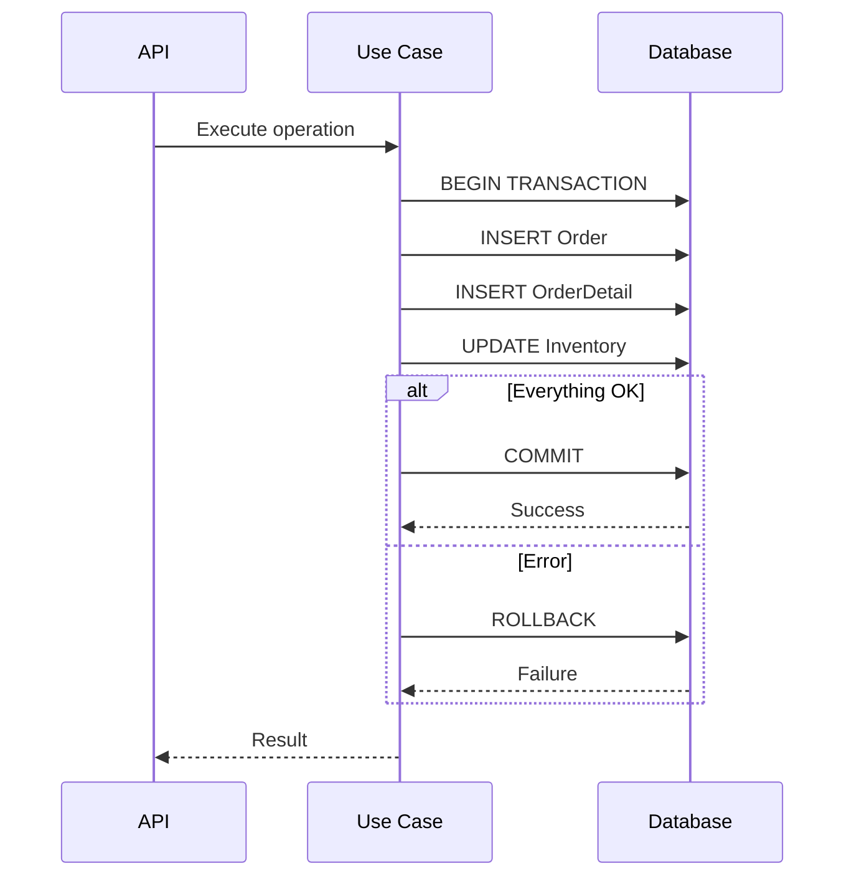

---

# 13. Manejo global de errores

Muy recomendable en FastAPI.

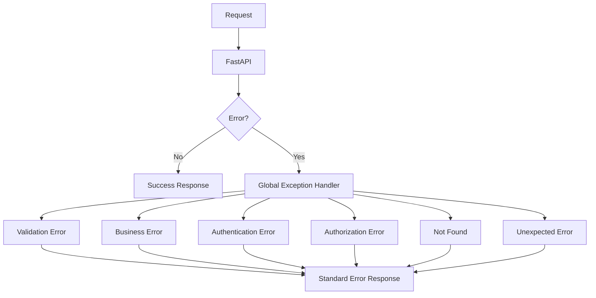

Y definir un contrato estándar:

```json
{
  "code": "CLIENT_ALREADY_EXISTS",
  "message": "The client already exists",
  "details": [],
  "trace_id": "..."
}
```

---

# 14. Integraciones externas

Si tu backend consume otros sistemas:

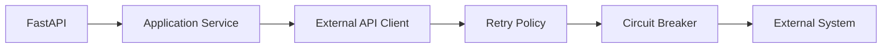

Aquí puedes documentar:

* timeout
* retry
* circuit breaker
* rate limiting
* fallback
* idempotencia

---

# 15. Procesamiento asíncrono

Si tienes Celery, RabbitMQ, Kafka, Redis, etc.:

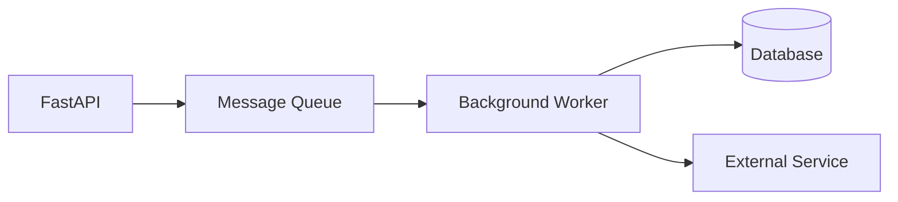

Y para un proceso:

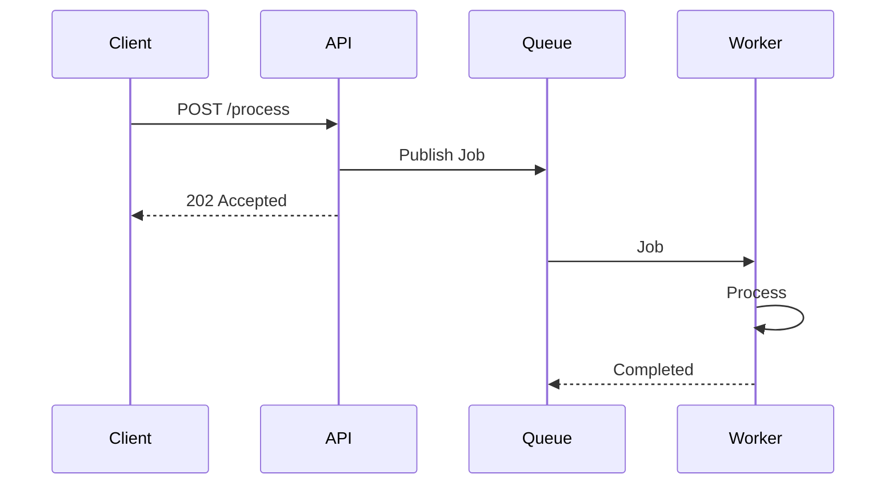

---

# 16. Caché

Si utilizas Redis:

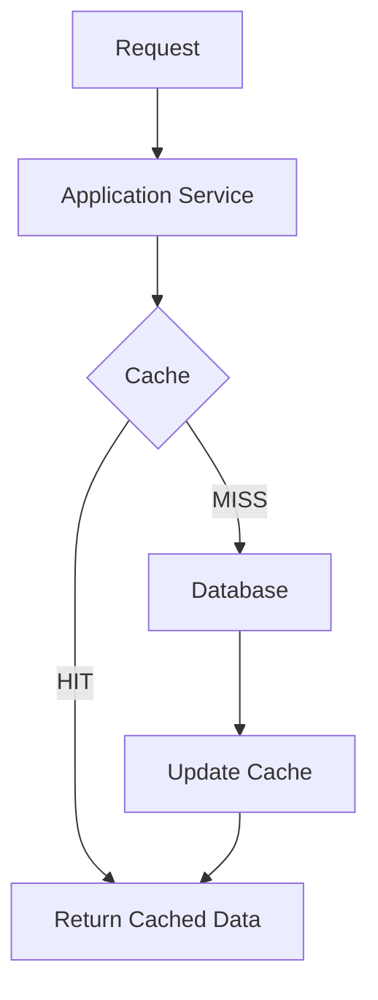

---

# 17. Observabilidad

Para backend empresarial esto es casi obligatorio.

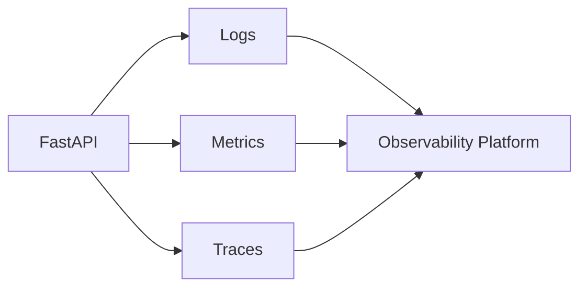

Y puedes definir:

```text
Correlation ID
Trace ID
Request ID
Application logs
Business logs
Error logs
Performance metrics
Database metrics
External API metrics
```

---

# 18. Health Checks

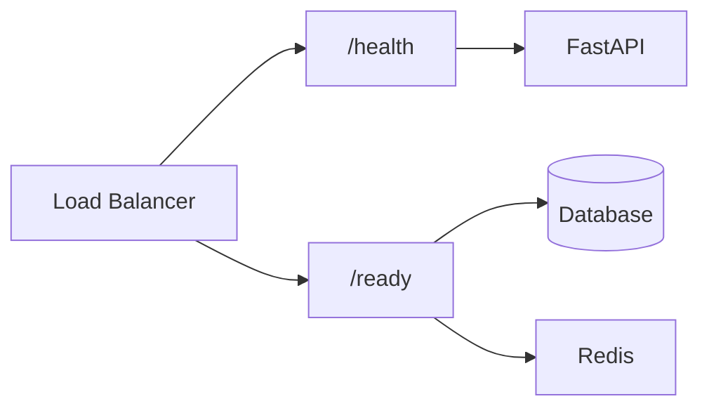

Puedes diferenciar:

```text
/health
→ ¿el proceso está vivo?

/ready
→ ¿el servicio está preparado para recibir tráfico?
```

---

# 19. Rate Limiting

Especialmente importante para APIs públicas.

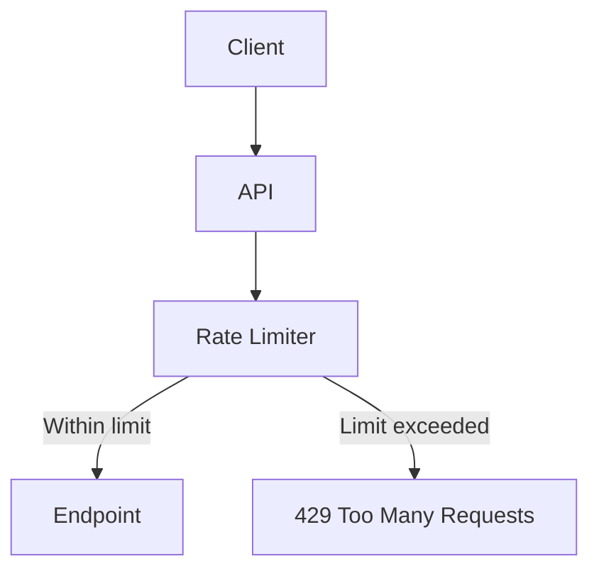

---

# 20. Deployment

Finalmente, el diagrama físico.

```mermaid
flowchart TB

    Internet["Internet"]

    WAF["WAF"]

    LB["Load Balancer"]

    API1["FastAPI Instance 1"]
    API2["FastAPI Instance 2"]

    DB[("Database")]

    Redis["Redis"]

    Internet --> WAF
    WAF --> LB

    LB --> API1
    LB --> API2

    API1 --> DB
    API2 --> DB

    API1 --> Redis
    API2 --> Redis
```

---

# 21. CI/CD

También puede formar parte de arquitectura operacional:

```mermaid
flowchart LR

    Developer["Developer"]

    Git["Git Repository"]

    CI["CI Pipeline"]

    Tests["Tests"]

    Build["Build"]

    Security["Security Scan"]

    Deploy["Deployment"]

    Runtime["Backend Runtime"]

    Developer --> Git
    Git --> CI

    CI --> Tests
    Tests --> Build
    Build --> Security
    Security --> Deploy
    Deploy --> Runtime
```

---

# 22. ADR

Al igual que frontend, recomiendo ADR para las decisiones importantes.

```text
adr/
├── ADR-001-fastapi.md
├── ADR-002-clean-architecture.md
├── ADR-003-database.md
├── ADR-004-orm.md
├── ADR-005-authentication.md
├── ADR-006-authorization.md
├── ADR-007-error-handling.md
├── ADR-008-caching.md
├── ADR-009-async-processing.md
├── ADR-010-observability.md
└── ADR-011-deployment.md
```

