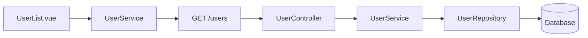
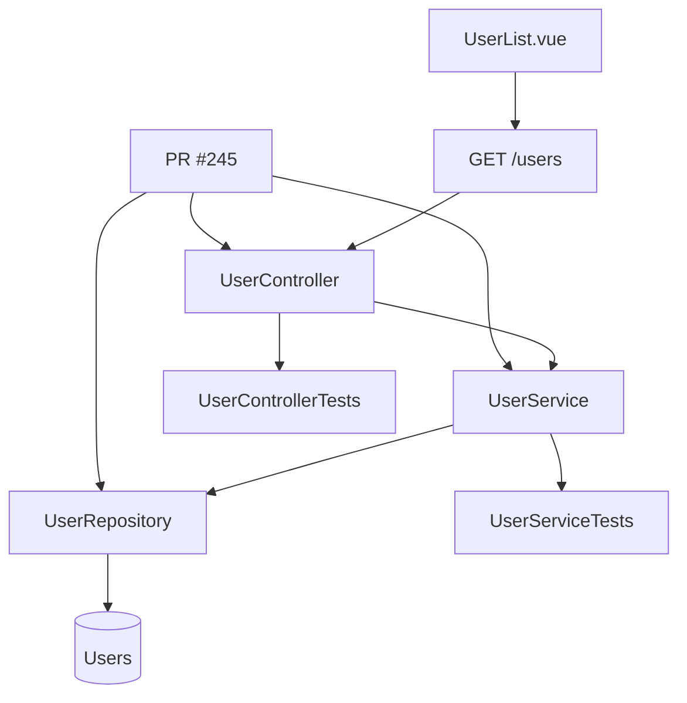
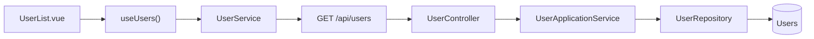
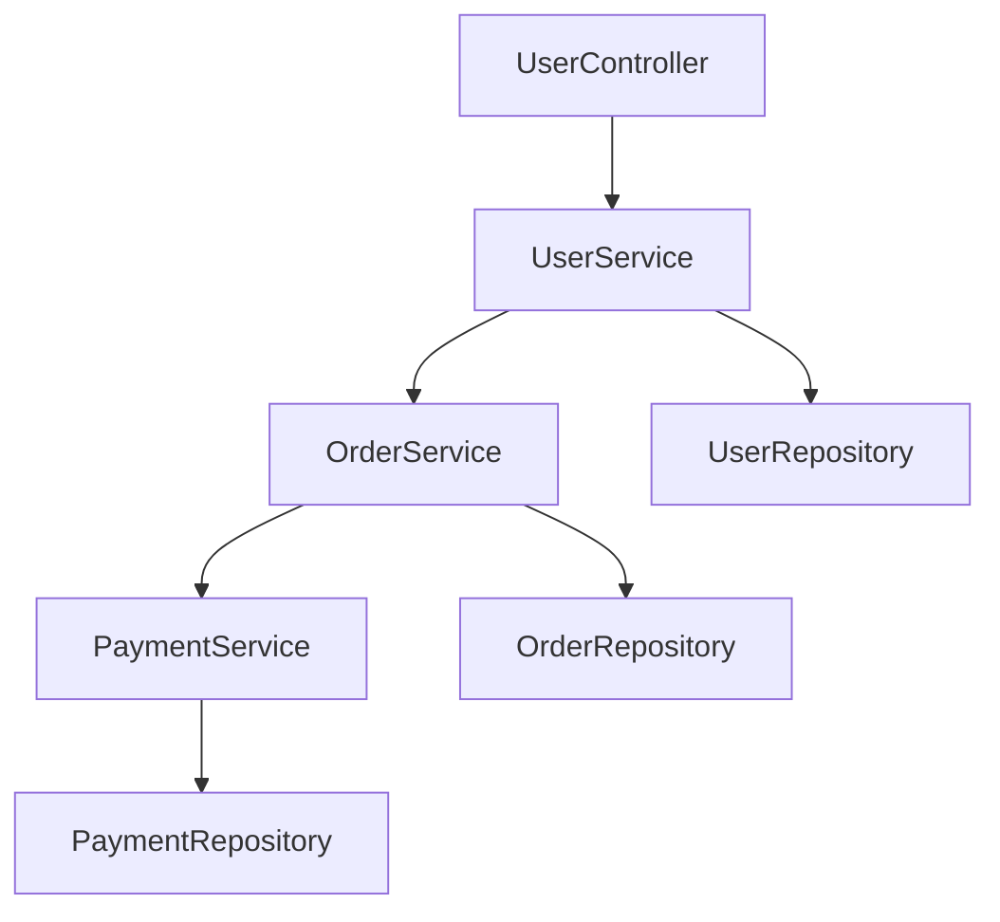
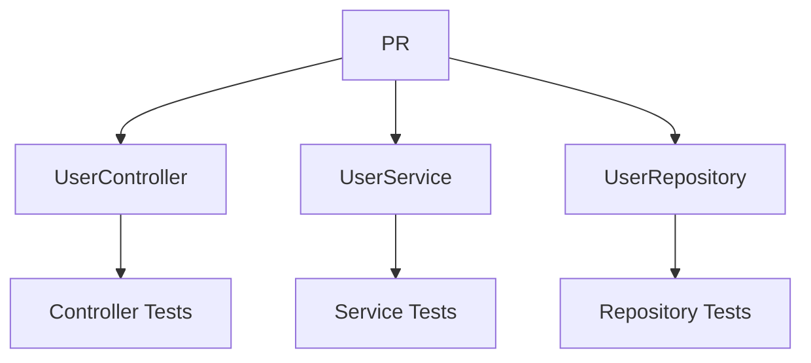

Sí. Si hablamos de un **agente de IA que revisa automáticamente Frontend + Backend**, yo evitaría que al terminar simplemente muestre los mismos diagramas de arquitectura que ya existen.

El agente puede generar **diagramas derivados de lo que realmente encontró en el código**. Ahí hay bastante valor.

### Los que yo agregaría

| Diagrama                                 | ¿Qué muestra?                                                  | Valor del Code Review                              |
| ---------------------------------------- | -------------------------------------------------------------- | -------------------------------------------------- |
| **1. Architecture Compliance** ⭐         | Arquitectura esperada vs arquitectura encontrada               | Detecta desviaciones                               |
| **2. Dependency Graph** ⭐                | Dependencias reales entre módulos/componentes                  | Detecta acoplamiento                               |
| **3. Code Execution Flow** ⭐             | Recorrido real de una operación a través del código            | Permite entender qué ejecuta realmente el sistema  |
| **4. Frontend ↔ Backend Traceability** ⭐ | Componente → API → Controller → Service → DB                   | Une ambos mundos                                   |
| **5. Change Impact Diagram** ⭐⭐⭐         | Qué componentes podrían verse afectados por los cambios del PR | Muy útil para el reviewer                          |
| **6. Security Flow**                     | Usuario → Auth → Front → API → permisos → DB                   | Detecta problemas de seguridad                     |
| **7. Technical Debt Map**                | Zonas con deuda técnica, duplicación, complejidad, etc.        | Visualiza hotspots                                 |
| **8. Test Coverage Map**                 | Código modificado → tests existentes/faltantes                 | Conecta Code Review + QA                           |
| **9. Error Propagation Flow**            | Dónde se generan, transforman y manejan errores                | Detecta errores mal gestionados                    |
| **10. Data Flow**                        | Cómo viajan y transforman los datos                            | Detecta fugas, transformaciones innecesarias, etc. |

Pero hay **uno que considero especialmente interesante para tu agente**:

## 🧠 1. Diagrama de desviación arquitectónica

El arquitecto define:

```text
Frontend
   ↓
Component
   ↓
Composable
   ↓
Service
   ↓
API
   ↓
Backend
   ↓
Controller
   ↓
Service
   ↓
Repository
   ↓
Database
```

El agente analiza el código y construye el flujo **real**.

Por ejemplo:



Y podría detectar:

```text
✅ Component → Composable
✅ Composable → Service
✅ Service → API
✅ API → Controller
❌ Controller → Repository
⚠️ Se está saltando la capa Service
```

Ese diagrama **no es simplemente documentación de Frontend o Backend**.

Es una representación de:

> **"Lo que la arquitectura dice que debería ocurrir" vs "lo que el código realmente hace".**

---

# ⭐ 2. El que más valor daría: Change Impact Diagram

Este me parece especialmente potente para un **AI Code Reviewer**.

Supongamos que el PR modifica:

```text
UserController
      ↓
UserService
      ↓
UserRepository
```

El agente analiza dependencias y genera:



Y el agente podría acompañarlo con:

```text
Archivos modificados:       7
Componentes afectados:      12
APIs afectadas:              2
Tests relacionados:          5
Tests faltantes:             2
```

Esto es muy diferente a un diagrama arquitectónico tradicional.

Es un:

> **Impact Analysis Diagram**

generado **dinámicamente para cada PR**.

---

# ⭐ 3. Frontend ↔ Backend Traceability

Este también sería excelente para tu escenario.

Por ejemplo:



El agente puede decir:

```text
Frontend
UserList.vue
   ↓
useUsers()
   ↓
UserService

Backend
UserController
   ↓
UserApplicationService
   ↓
UserRepository

Database
Users
```

Y detectar cosas como:

```text
⚠️ Frontend utiliza endpoint no documentado
⚠️ Endpoint utilizado por 4 componentes
⚠️ Backend endpoint sin test
⚠️ DTO frontend ≠ DTO backend
```

Este diagrama puede convertirse en uno de los **artefactos principales del agente**.

---

# ⭐ 4. Dependency / Coupling Diagram

El agente podría descubrir que tienes algo así:



Y detectar:

```text
UserService
 ├── OrderService
 ├── UserRepository
 └── PaymentService

⚠️ Alto acoplamiento
⚠️ Posible violación de separación de responsabilidades
```

Esto sería muy útil para un **Code Review arquitectónico**, porque no solamente encuentra bugs: encuentra **problemas estructurales**.

---

# ⭐ 5. Test Coverage / Risk Diagram

Aquí puedes conectar directamente tu agente de **Code Review con QA**.



El agente podría marcar:

```text
UserController       ✅ Tests
UserService          ✅ Tests
UserRepository       ❌ Sin tests

Riesgo detectado:
Cambio en componente sin cobertura automatizada.
```

Esto empieza a convertir tu Code Reviewer en algo más parecido a un:

**AI Engineering Quality Agent**

y no simplemente un "AI que revisa código".

---

# 🏆 Yo diseñaría el resultado final del agente así

Cuando termina el review, tendría una pantalla como:

```text
╔══════════════════════════════════════════════════╗
║          AI CODE REVIEW — PR #245               ║
╠══════════════════════════════════════════════════╣
║                                                  ║
║  📊 SUMMARY                                      ║
║                                                  ║
║  Files analyzed             23                   ║
║  Architecture violations    3                   ║
║  Security issues             1                   ║
║  Code quality issues         7                   ║
║  Tests missing               2                   ║
║                                                  ║
╠══════════════════════════════════════════════════╣
║                                                  ║
║  🏗 ARCHITECTURE                                 ║
║                                                  ║
║  Architecture Compliance       [Ver diagrama]    ║
║  Dependency Graph              [Ver diagrama]    ║
║                                                  ║
╠══════════════════════════════════════════════════╣
║                                                  ║
║  🔗 TRACEABILITY                                 ║
║                                                  ║
║  Frontend → Backend → DB        [Ver diagrama]   ║
║  Execution Flow                 [Ver diagrama]   ║
║                                                  ║
╠══════════════════════════════════════════════════╣
║                                                  ║
║  🎯 IMPACT ANALYSIS                              ║
║                                                  ║
║  Changed Components             [Ver diagrama]   ║
║  Dependency Impact              [Ver diagrama]   ║
║                                                  ║
╠══════════════════════════════════════════════════╣
║                                                  ║
║  🧪 QUALITY                                      ║
║                                                  ║
║  Test Coverage                  [Ver diagrama]   ║
║  Risk Areas                     [Ver diagrama]   ║
║                                                  ║
╚══════════════════════════════════════════════════╝
```

### Y hay una diferencia conceptual importante

Los diagramas tradicionales responden:

> **"¿Cómo está diseñado el sistema?"**

Los diagramas del agente deberían responder:

> **"¿Cómo está implementado realmente?"**

y, sobre todo:

> **"¿Qué cambió, qué afecta, qué está mal y qué riesgo introduce este código?"**

Por eso, para tu agente yo incorporaría como **diagramas propios del Code Review**:

1. 🏗️ **Architecture Compliance Diagram**
2. 🔗 **Dependency Graph**
3. 🔄 **Real Execution Flow**
4. 🌐 **Frontend → Backend Traceability**
5. 🎯 **Change Impact Diagram** ← **el más diferencial**
6. 🧪 **Test Coverage / Risk Map**
7. 🔐 **Security Flow**
8. 🧹 **Technical Debt / Code Hotspot Map**

De todos ellos, **Change Impact + Architecture Compliance + Frontend/Backend Traceability** formarían un conjunto bastante potente y diferente de los diagramas que normalmente prepara un arquitecto Frontend o Backend.
