# DevOps Architecture Document

Yo organizaría los diagramas DevOps en 6 áreas:

```text
                    DEVOPS ARCHITECTURE
                           │
       ┌───────────────────┼───────────────────┐
       ▼                   ▼                   ▼
   SOURCE CODE          CI/CD              INFRASTRUCTURE
       │                   │                   │
       ▼                   ▼                   ▼
    Git Flow          Build/Test/Deploy    Runtime/Network
       │                   │                   │
       └───────────────────┼───────────────────┘
                           ▼
                    OPERATIONS
                           │
             ┌─────────────┼─────────────┐
             ▼             ▼             ▼
        Monitoring      Logging       Security
```

## 1. Diagrama DevOps de alto nivel

Este sería el **diagrama principal** del documento.

```mermaid
flowchart LR

    Developer["👨‍💻 Developer"]

    Git["Git Repository"]

    CI["CI Pipeline"]

    Build["Build"]

    Test["Automated Tests"]

    Security["Security Scan"]

    Artifact["Artifact / Image"]

    CD["CD Pipeline"]

    Dev["DEV"]

    QA["QA / UAT"]

    Prod["PRODUCTION"]

    Monitor["Monitoring / Observability"]

    Developer --> Git
    Git --> CI

    CI --> Build
    Build --> Test
    Test --> Security
    Security --> Artifact

    Artifact --> CD

    CD --> Dev
    Dev --> QA
    QA --> Prod

    Prod --> Monitor
    Monitor -.-> Developer
```

Este responde:

> ¿Cómo pasa el software desde el desarrollador hasta producción y cómo se controla después?

---

# 2. Git Flow / estrategia de ramas

El arquitecto DevOps debería documentar la estrategia de branching.

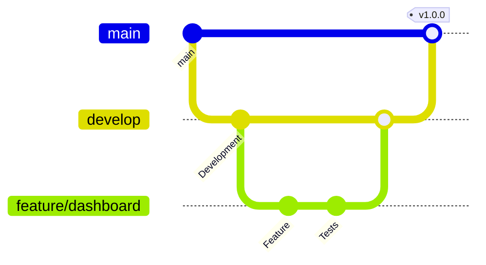

Puedes documentar algo como:

```text
main
  │
  └── develop
        │
        ├── feature/*
        ├── bugfix/*
        └── hotfix/*
```

---

# 3. CI Pipeline

Este es uno de los diagramas **más importantes**.

```mermaid
flowchart LR

    Commit["Git Commit"]

    Trigger["Pipeline Trigger"]

    Checkout["Checkout"]

    Dependencies["Install Dependencies"]

    Lint["Lint"]

    Unit["Unit Tests"]

    Build["Build"]

    Security["Security Scan"]

    Artifact["Publish Artifact"]

    Commit --> Trigger
    Trigger --> Checkout
    Checkout --> Dependencies
    Dependencies --> Lint
    Lint --> Unit
    Unit --> Build
    Build --> Security
    Security --> Artifact
```

Puedes hacer uno para frontend y otro para backend si sus pipelines son diferentes.

---

# 4. CI/CD completo

Una versión más empresarial:

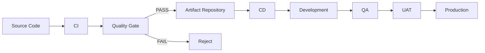

---

# 5. Deployment Strategy

Aquí documentas **cómo** se despliega.

Por ejemplo, Rolling Deployment:

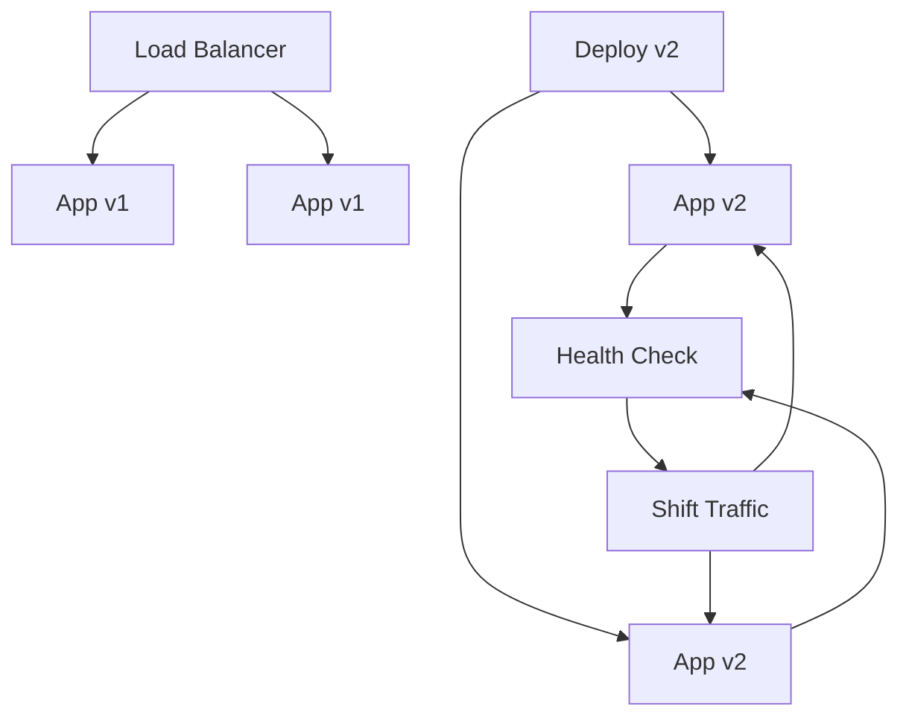

---

# 6. Blue-Green Deployment

Muy útil para aplicaciones críticas.

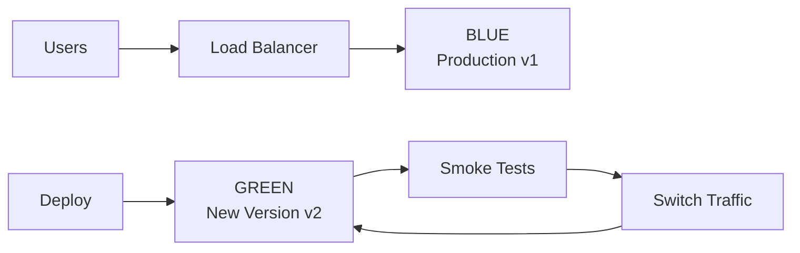

Si algo falla:

```text
GREEN ❌
   ↓
Rollback
   ↓
BLUE ✅
```

---

# 7. Canary Deployment

Para sistemas donde quieres liberar gradualmente:

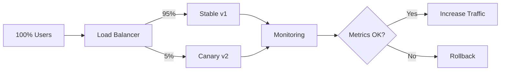

---

# 8. Infraestructura

El DevOps debería tener un diagrama de infraestructura.

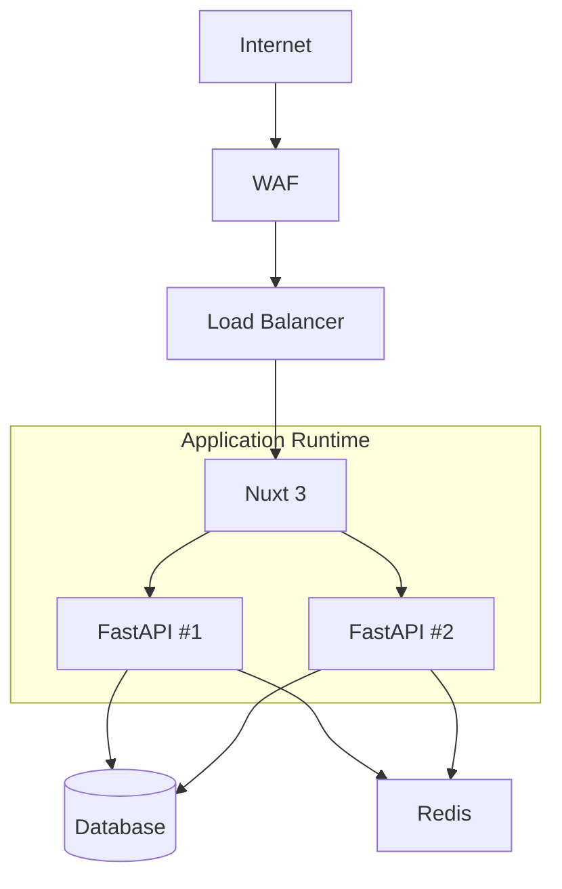

---

# 9. Red

Este es más de infraestructura.

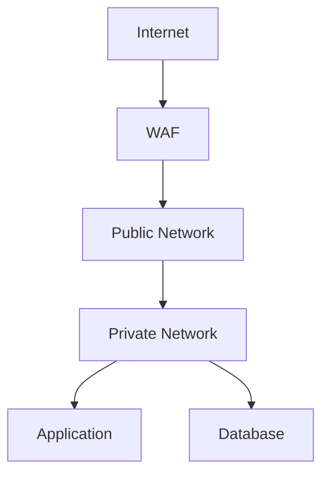

La idea es mostrar:

* Internet
* WAF
* Load Balancer
* Public subnet
* Private subnet
* Application
* Database
* Firewall
* Security Groups

---

# 10. Docker / Containers

Si vas a contenerizar Nuxt y FastAPI:

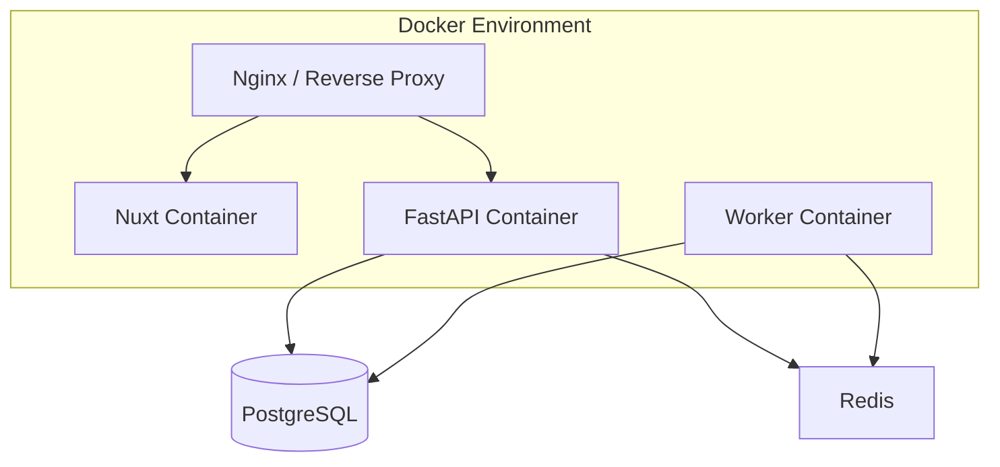

---

# 11. Container Build

También puedes representar cómo se construye la imagen:

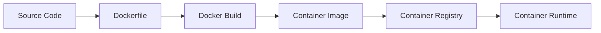

---

# 12. Registry

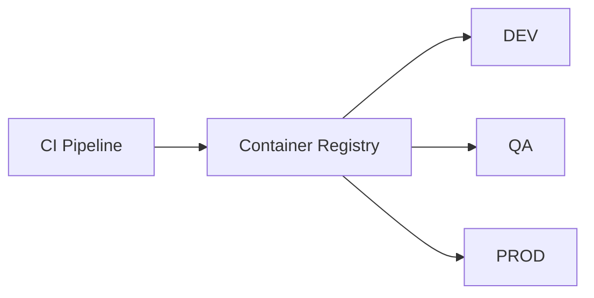

Esto es especialmente útil si tienes:

* Docker Hub
* GitHub Container Registry
* Azure Container Registry
* AWS ECR
* Google Artifact Registry

---

# 13. Infrastructure as Code

Si utilizas Terraform, Pulumi, Bicep, CloudFormation, etc.:

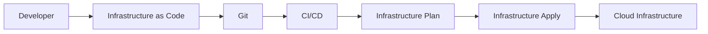

---

# 14. Environments

Este diagrama es fundamental.

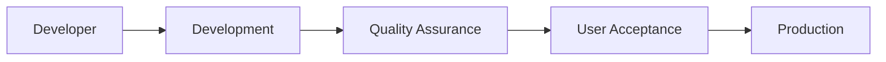

Puedes añadir las características:

```text
DEV
 ├── Debug enabled
 ├── Test data
 └── Frequent deployments

QA
 ├── Integration tests
 └── Automated validation

UAT
 ├── Business validation
 └── Release candidate

PROD
 ├── Real users
 ├── Real data
 └── Controlled deployment
```

---

# 15. Configuration Management

Muy importante:

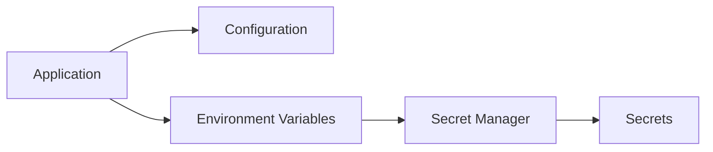

La regla debería quedar explícita:

```text
❌ Secrets dentro del código
❌ Secrets dentro de Git
❌ Passwords dentro de Dockerfile

✅ Secret Manager
✅ Environment Variables
✅ Managed Identity cuando sea posible
```

---

# 16. Observabilidad

Para DevOps, este es otro diagrama principal.

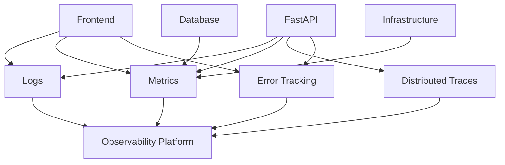

---

# 17. Alertas

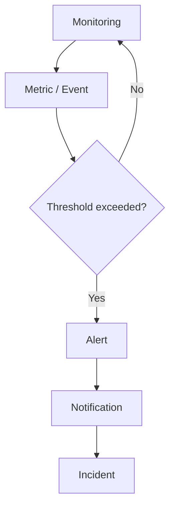

---

# 18. Incident Management

Como tú trabajas además con **Scrum y atención de incidentes**, este diagrama te puede servir bastante:

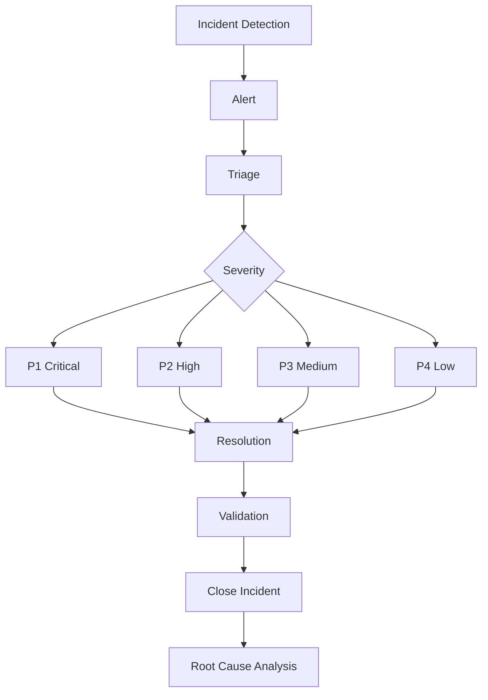

---

# 19. Backup / Disaster Recovery

Para aplicaciones empresariales:

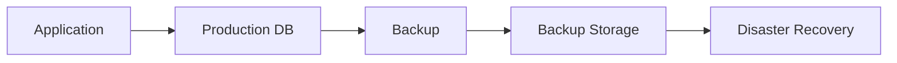

Puedes documentar:

```text
RPO → Recovery Point Objective
RTO → Recovery Time Objective
Backup frequency
Retention
Restore procedure
DR strategy
```

---

# 20. Seguridad DevSecOps

Muy importante actualmente.

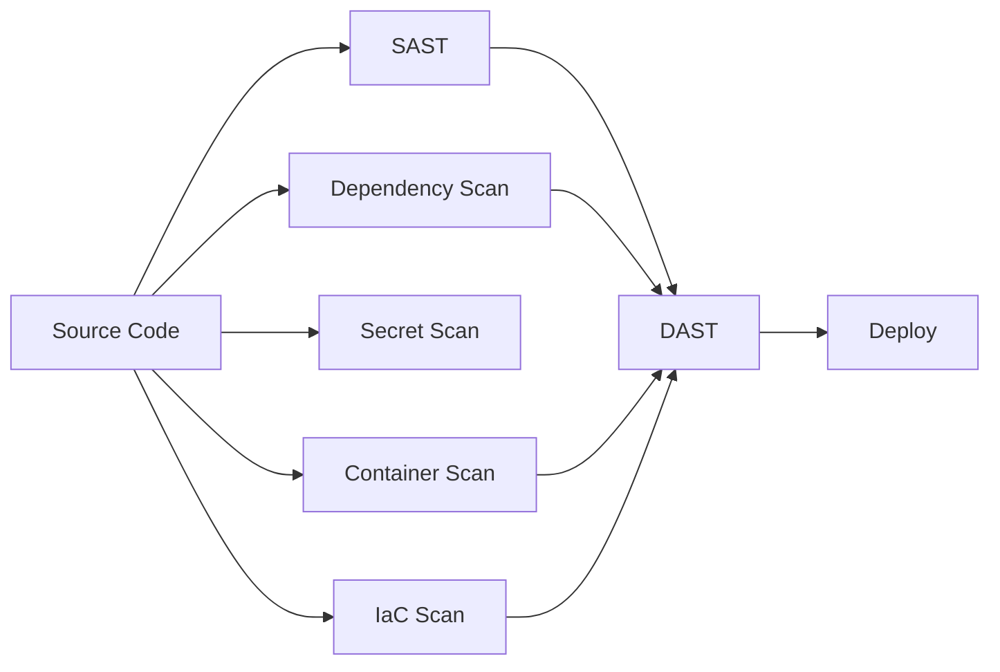

---

# 21. Pipeline DevSecOps completo

Este podría ser tu **diagrama estrella de DevOps**:

```mermaid
flowchart LR

    Code["Developer<br/>Code"]

    Git["Git"]

    Build["Build"]

    Unit["Unit Tests"]

    SAST["SAST"]

    Dependency["Dependency Scan"]

    Image["Container Build"]

    ImageScan["Container Scan"]

    Registry["Container Registry"]

    DeployDev["Deploy DEV"]

    Integration["Integration Tests"]

    DeployQA["Deploy QA"]

    UAT["UAT"]

    DeployProd["Deploy PROD"]

    Monitor["Monitoring"]

    Code --> Git
    Git --> Build

    Build --> Unit
    Unit --> SAST
    SAST --> Dependency

    Dependency --> Image
    Image --> ImageScan
    ImageScan --> Registry

    Registry --> DeployDev
    DeployDev --> Integration
    Integration --> DeployQA

    DeployQA --> UAT
    UAT --> DeployProd

    DeployProd --> Monitor

    Monitor -. feedback .-> Git
```

Esto representa muy bien el concepto:

**Dev → Build → Test → Secure → Package → Deploy → Monitor → Feedback**

---

# 22. Diagrama de arquitectura DevOps completo

Si tuviera que escoger **un único diagrama para presentar a un arquitecto, jefe de desarrollo o comité técnico**, haría algo así:

```mermaid
flowchart TB

    Developer["👨‍💻 Developers"]

    Git["Git Repository"]

    subgraph CI["CI — Continuous Integration"]

        Build["Build"]

        Tests["Automated Tests"]

        Quality["Quality Gates"]

        Security["Security Scans"]
    end

    Registry["Artifact / Container Registry"]

    subgraph CD["CD — Continuous Delivery"]

        DEV["DEV"]

        QA["QA"]

        UAT["UAT"]

        PROD["PRODUCTION"]
    end

    subgraph Production["Production Infrastructure"]

        WAF["WAF"]

        LB["Load Balancer"]

        FE["Nuxt 3"]

        API["FastAPI"]

        DB[("Database")]

        Cache["Redis"]
    end

    subgraph Observability["Observability"]

        Logs["Logs"]

        Metrics["Metrics"]

        Traces["Traces"]

        Alerts["Alerts"]
    end

    Developer --> Git

    Git --> Build
    Build --> Tests
    Tests --> Quality
    Quality --> Security

    Security --> Registry

    Registry --> DEV
    DEV --> QA
    QA --> UAT
    UAT --> PROD

    PROD --> WAF
    WAF --> LB
    LB --> FE
    LB --> API

    API --> DB
    API --> Cache

    FE --> Logs
    API --> Logs
    API --> Metrics
    API --> Traces
    DB --> Metrics

    Logs --> Alerts
    Metrics --> Alerts
    Traces --> Alerts
```

---

# 🏗️ Cómo organizaría tu documentación

Yo terminaría con esta estructura:

```text
1. Overview
2. DevOps Architecture
3. Git Strategy
4. CI Pipeline
5. CD Pipeline
6. Environments
7. Deployment Strategy
8. Infrastructure
9. Networking
10. Containers
11. Infrastructure as Code
12. Configuration Management
13. Secrets Management
14. Security / DevSecOps
15. Observability
16. Monitoring
17. Alerting
18. Incident Management
19. Backup & Disaster Recovery
20. Rollback Strategy
21. ADRs
```
