# Frontend Architecture Document

## 1. Información general

```text
Nombre del sistema:
Versión:
Fecha:
Arquitecto:
Equipo:
Repositorio:
Frontend:
Backend:
```

### 1.1 Objetivo

Describe brevemente:

* Qué problema resuelve el frontend.
* Usuarios objetivo.
* Principales funcionalidades.
* Sistemas externos con los que interactúa.

---

# 2. Contexto de arquitectura

### 2.1 Diagrama de contexto

Este es el nivel más alto.

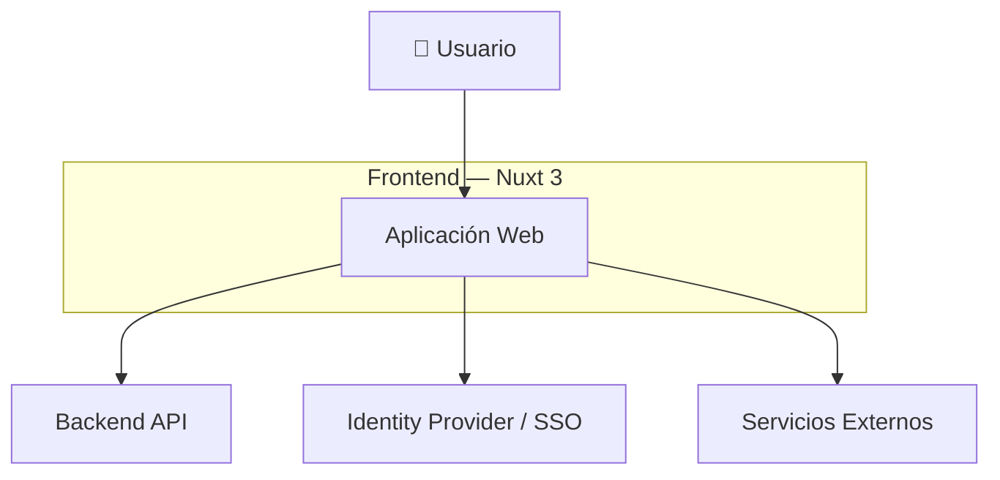

**Pregunta que responde:**

> ¿Qué actores y sistemas interactúan con nuestra aplicación?

---

# 3. Arquitectura general

Aquí puedes combinar C4 con una arquitectura por capas.

### 3.1 Diagrama de arquitectura

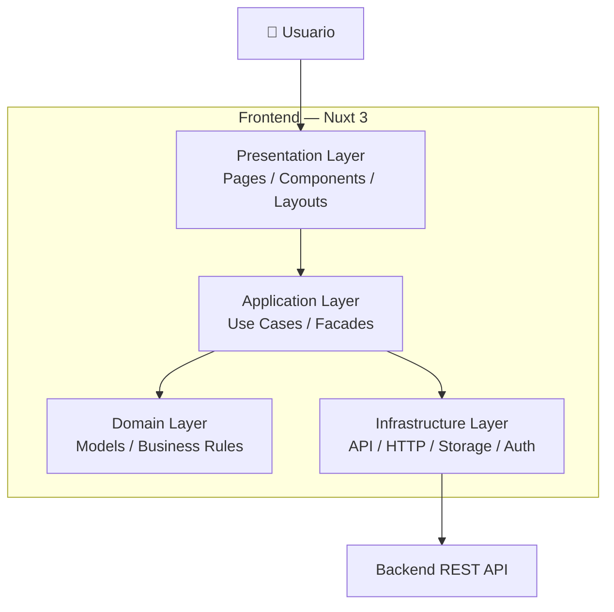

Aquí defines **las reglas arquitectónicas**.

Por ejemplo:

> Los componentes de presentación no deben realizar llamadas HTTP directamente. La comunicación con backend debe realizarse mediante servicios de infraestructura.

---

# 4. Contenedores

Aunque todo sea "frontend", conviene separar conceptualmente sus grandes bloques.

### 4.1 Container Diagram

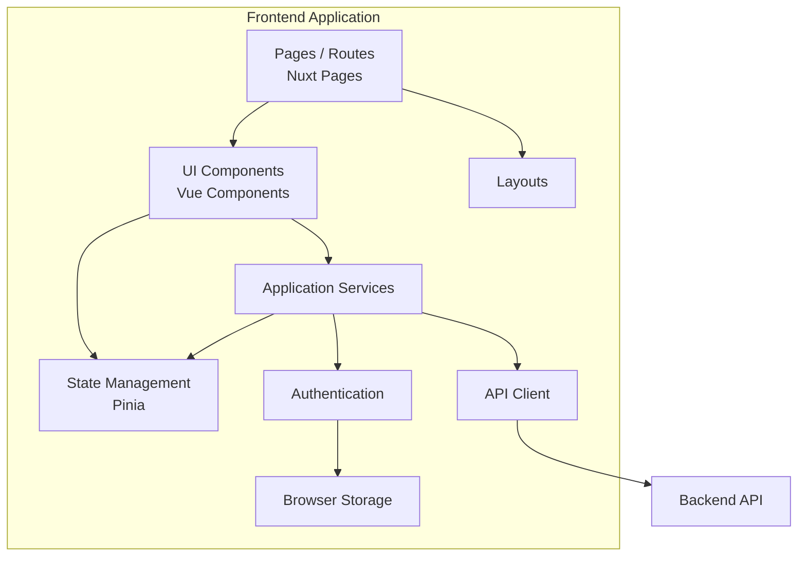

Este diagrama te permite explicar **qué componentes arquitectónicos existen y cómo se relacionan**.

---

# 5. Estructura del proyecto

Aquí ya bajas al nivel de código.

### 5.1 Diagrama de módulos

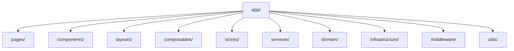

Y puedes acompañarlo con una tabla:

| Módulo           | Responsabilidad                     |
| ---------------- | ----------------------------------- |
| `pages`          | Rutas y composición de páginas      |
| `components`     | Componentes reutilizables           |
| `layouts`        | Estructura visual                   |
| `composables`    | Lógica reutilizable                 |
| `stores`         | Estado global                       |
| `services`       | Casos de uso                        |
| `domain`         | Modelos y reglas                    |
| `infrastructure` | API, storage, autenticación         |
| `middleware`     | Guards y validaciones de navegación |
| `utils`          | Utilidades transversales            |

---

# 6. Componentes

Aquí documentas componentes importantes.

### 6.1 Component Diagram

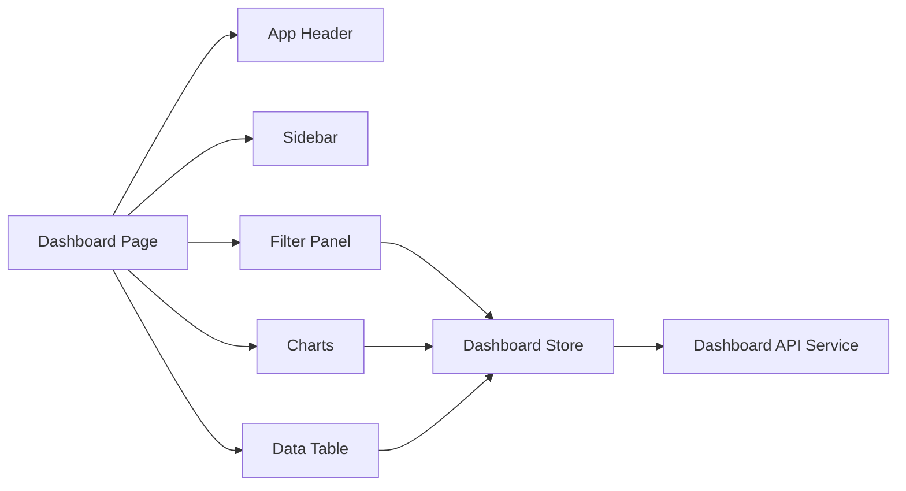

Este diagrama es especialmente útil para **funcionalidades complejas**.

No necesitas hacer uno por cada componente.

---

# 7. Navegación

Este es uno de los diagramas que más ayuda al equipo frontend.

### 7.1 Routing Diagram

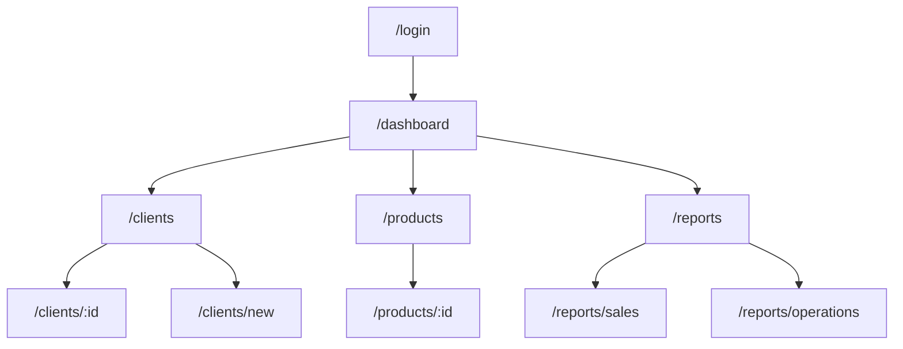

Puedes agregar:

* rutas públicas
* rutas protegidas
* roles
* permisos
* lazy loading

---

# 8. Autenticación y autorización

Para una aplicación empresarial este diagrama es importante.

### 8.1 Authentication Flow

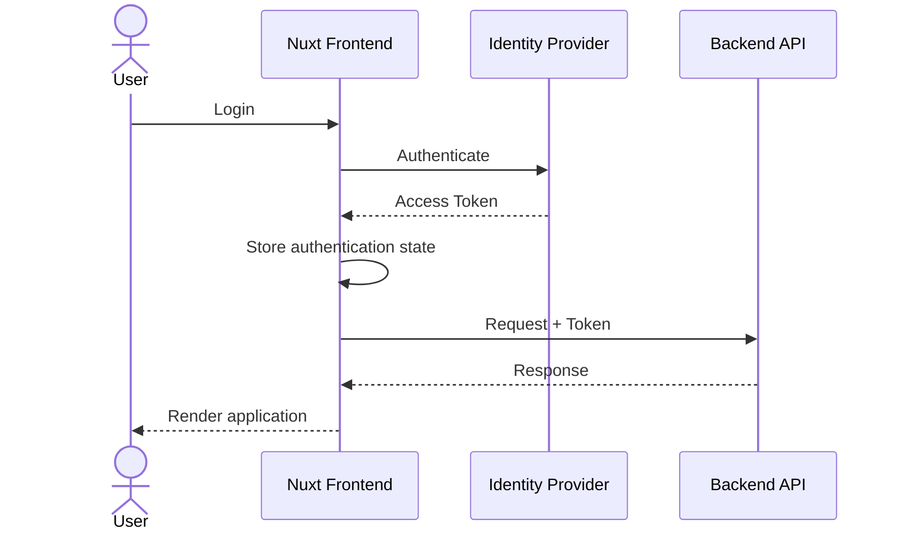

---

# 9. Autorización

Puedes separar autenticación de autorización.

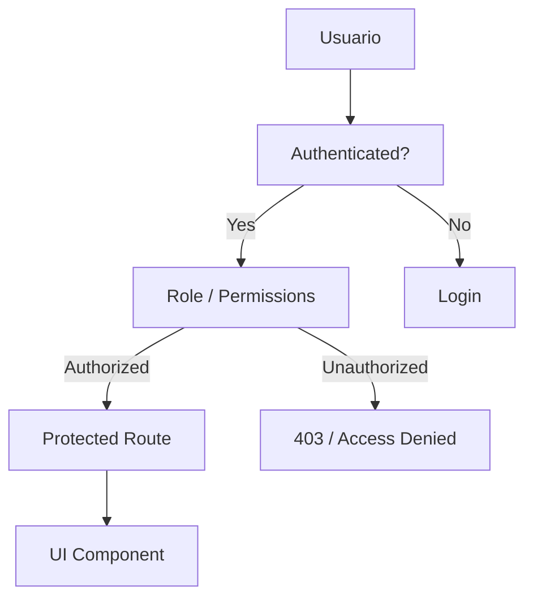

---

# 10. Gestión del estado

Si utilizas Pinia:

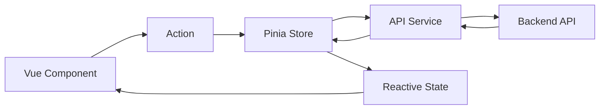

Aquí debes documentar qué estado es:

* local
* global
* persistente
* temporal
* derivado

---

# 11. Comunicación con backend

### 11.1 API Communication

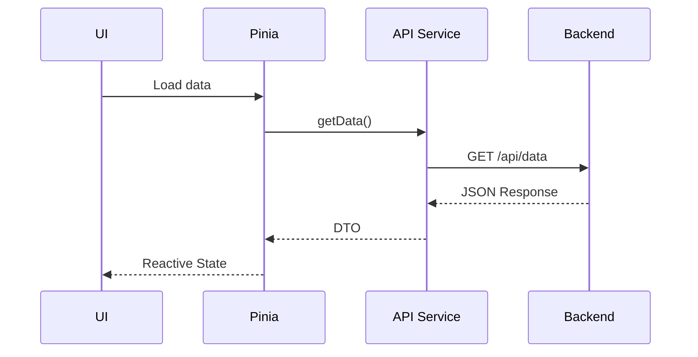

Esto ayuda muchísimo cuando varios desarrolladores trabajan sobre el frontend.

---

# 12. Manejo de errores

Un arquitecto debería definir esto explícitamente.

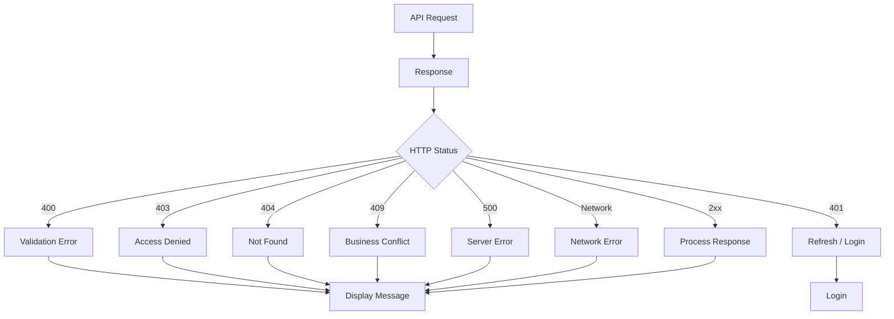

---

# 13. Flujo de una funcionalidad crítica

No hagas diagramas de secuencia para absolutamente todo.

Selecciona los procesos críticos.

Por ejemplo:

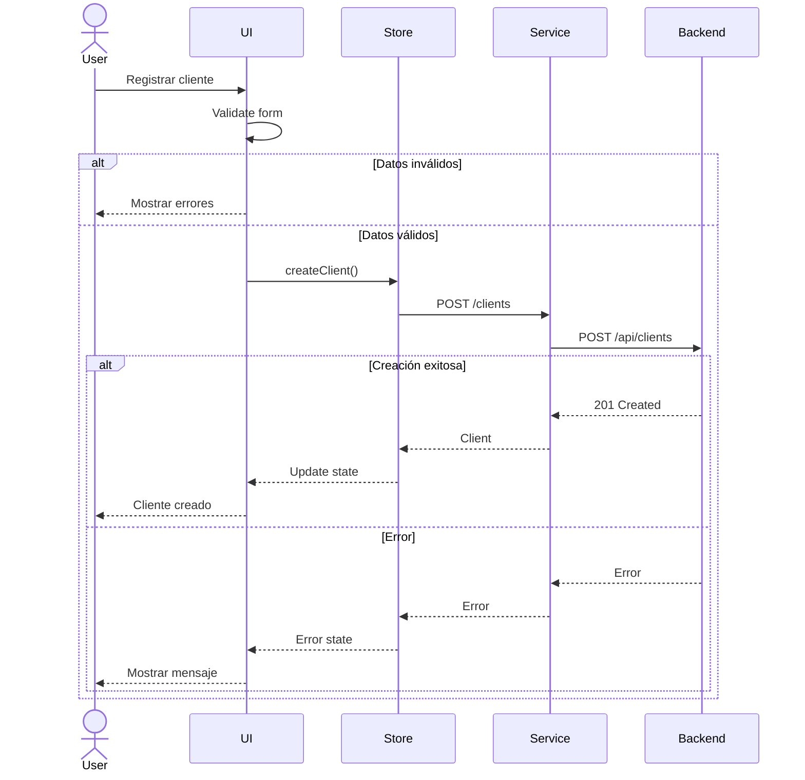

---

# 14. Diagrama de estados

Muy útil para entidades con workflow.

Por ejemplo, un presupuesto:

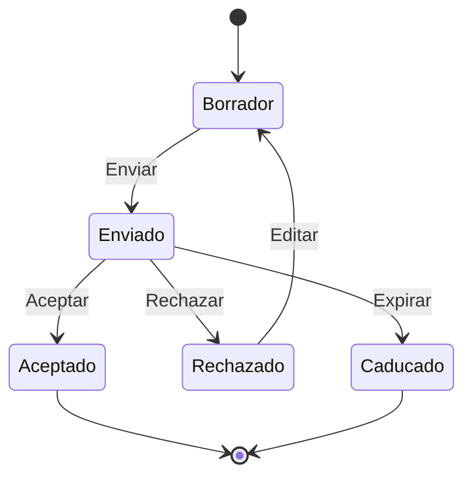

Esto evita que cada desarrollador interprete el flujo de manera diferente.

---

# 15. Seguridad

Además del login, documentaría las principales decisiones:

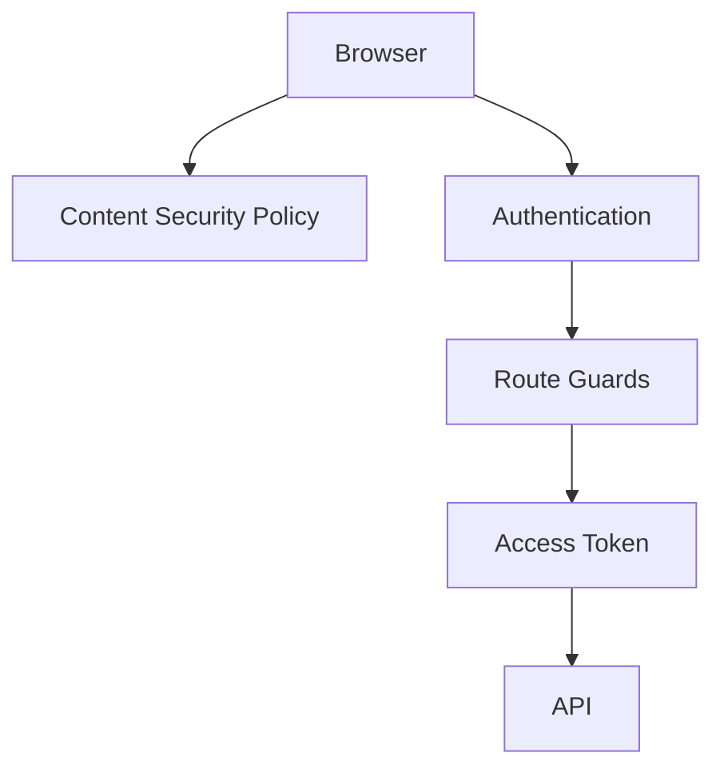

Y en texto:

```text
- Authentication: OAuth2 / OIDC
- Authorization: RBAC
- Transport: HTTPS
- API authentication: Bearer Token
- Route protection: Nuxt Middleware
- Secrets: Never stored in frontend
- Sensitive data: Never stored in localStorage unless explicitly justified
```

---

# 16. Performance

Aquí normalmente no necesitas un diagrama enorme.

Puedes representar:

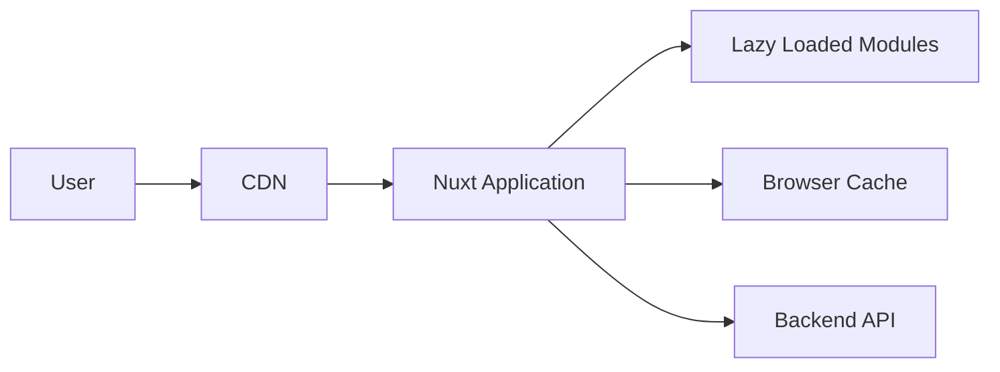

Y documentar decisiones como:

* SSR / CSR / SSG
* lazy loading
* code splitting
* caching
* CDN
* optimización de imágenes
* virtualización de tablas
* debounce/throttle
* bundle optimization

---

# 17. Observabilidad

En aplicaciones empresariales modernas yo incluiría esto.

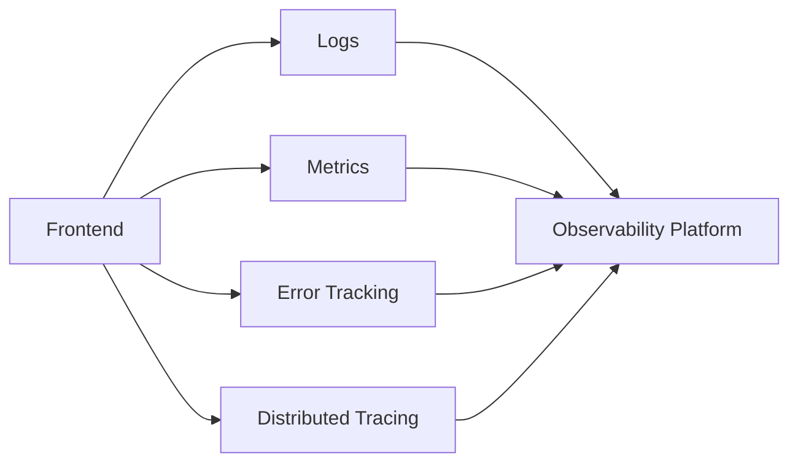

Por ejemplo, si utilizas Dynatrace, Application Insights, New Relic, etc., aquí documentas la integración.

---

# 18. Deployment

Finalmente:

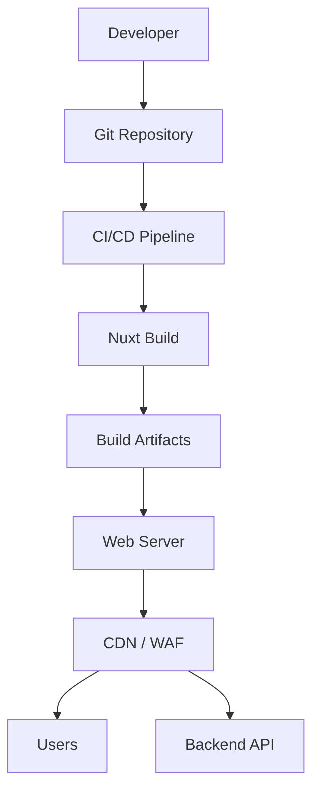

---

# 19. ADR — Architecture Decision Records

Y aquí hay algo que considero **muy importante**.

Los diagramas explican **qué arquitectura tenemos**.

Los ADR explican **por qué la tenemos**.

Por ejemplo:

```text
ADR-001 — Selección de Nuxt 3

Contexto:
La aplicación requiere SSR, routing y estructura modular.

Decisión:
Utilizar Nuxt 3 sobre Vue 3 standalone.

Consecuencias:
+ Routing integrado
+ SSR
+ Estructura convencional
+ Ecosistema Nuxt

Trade-offs:
- Mayor complejidad que Vue standalone
```

Otros ADR podrían ser:

```text
ADR-002 — Pinia para State Management
ADR-003 — API Client centralizado
ADR-004 — Estrategia de autenticación
ADR-005 — Manejo global de errores
ADR-006 — Estrategia SSR/CSR
ADR-007 — Estructura de módulos
ADR-008 — Estrategia de testing
ADR-009 — Observabilidad
ADR-010 — Estrategia de deployment
```

---

# La estructura final que yo usaría

Para tu documentación, quedaría así:

```text
docs/
└── architecture/
    └── frontend/
        │
        ├── 01-context.md
        ├── 02-architecture.md
        ├── 03-containers.md
        ├── 04-components.md
        ├── 05-routing.md
        ├── 06-state-management.md
        ├── 07-api-integration.md
        ├── 08-authentication.md
        ├── 09-authorization.md
        ├── 10-error-handling.md
        ├── 11-critical-flows.md
        ├── 12-security.md
        ├── 13-performance.md
        ├── 14-observability.md
        ├── 15-deployment.md
        │
        └── adr/
            ├── ADR-001-nuxt.md
            ├── ADR-002-state-management.md
            ├── ADR-003-authentication.md
            └── ...
```

## 🎯 Y si quieres hacerlo realmente "de arquitecto"

Yo no intentaría tener **20 diagramas**.

Para un proyecto real, el conjunto mínimo que considero bastante sólido sería:

```text
                    FRONTEND ARCHITECTURE
                             │
           ┌─────────────────┼─────────────────┐
           ▼                 ▼                 ▼
       CONTEXTO          ESTRUCTURA        DESPLIEGUE
           │                 │                 │
           ▼                 ▼                 ▼
       C4 Context        Containers        Deployment
                             │
                             ▼
                         Components
                             │
              ┌──────────────┼──────────────┐
              ▼              ▼              ▼
           Routing         State           API
              │              │              │
              └──────────────┼──────────────┘
                             ▼
                      SECUENCIAS / FLOWS
                             │
                             ▼
                     SECURITY / ERRORS
```
