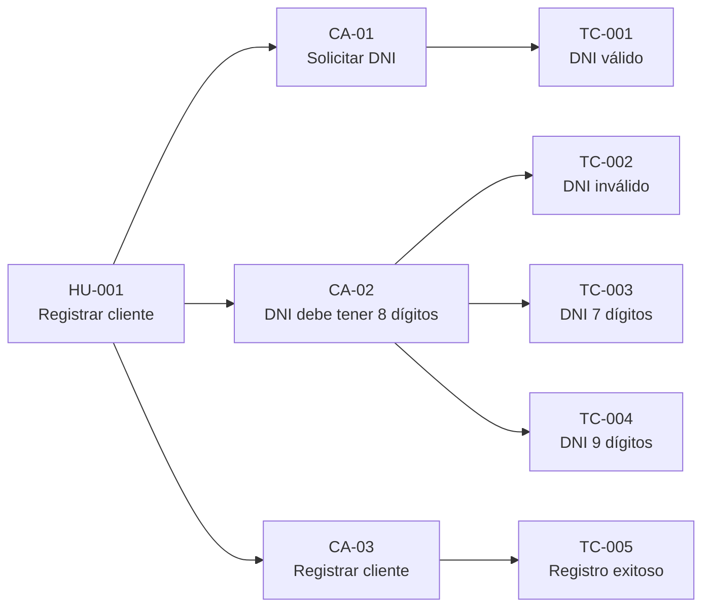
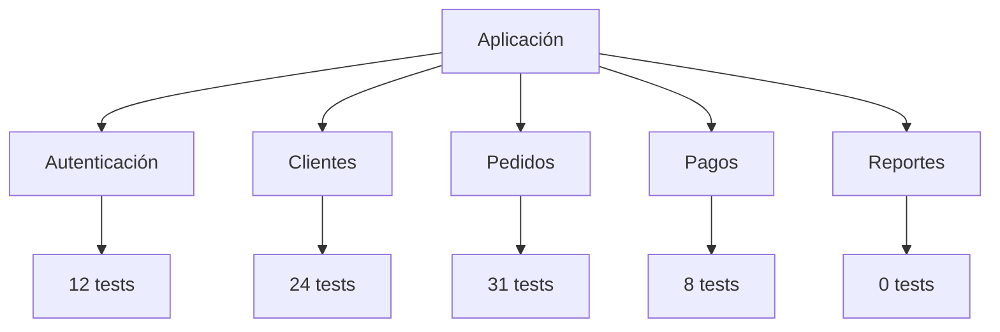
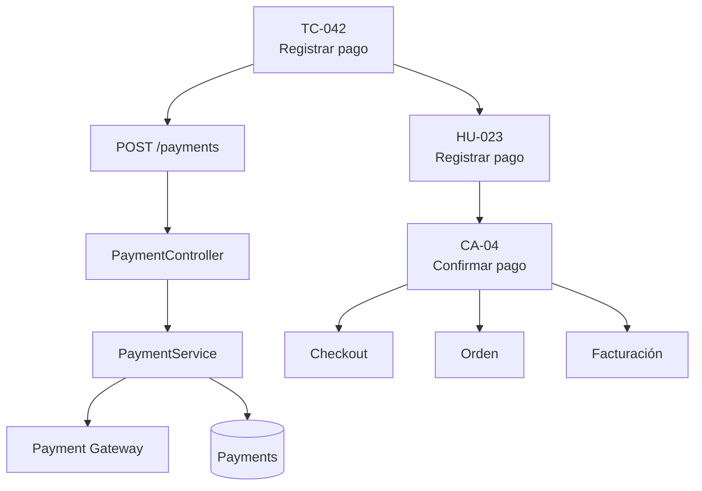
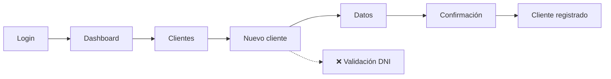
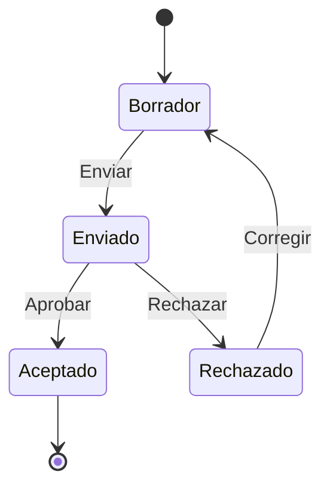
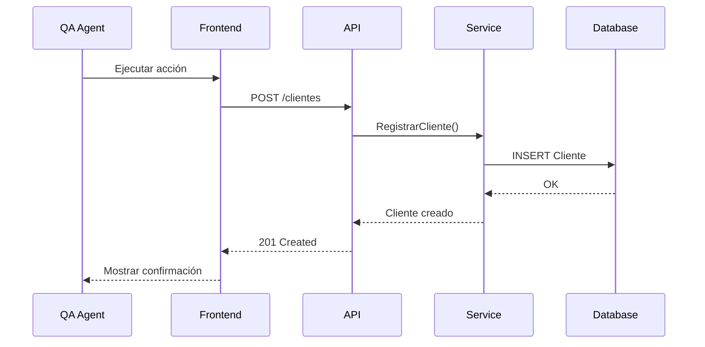
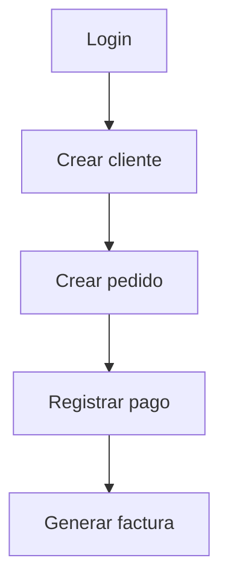
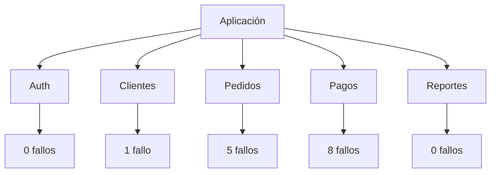
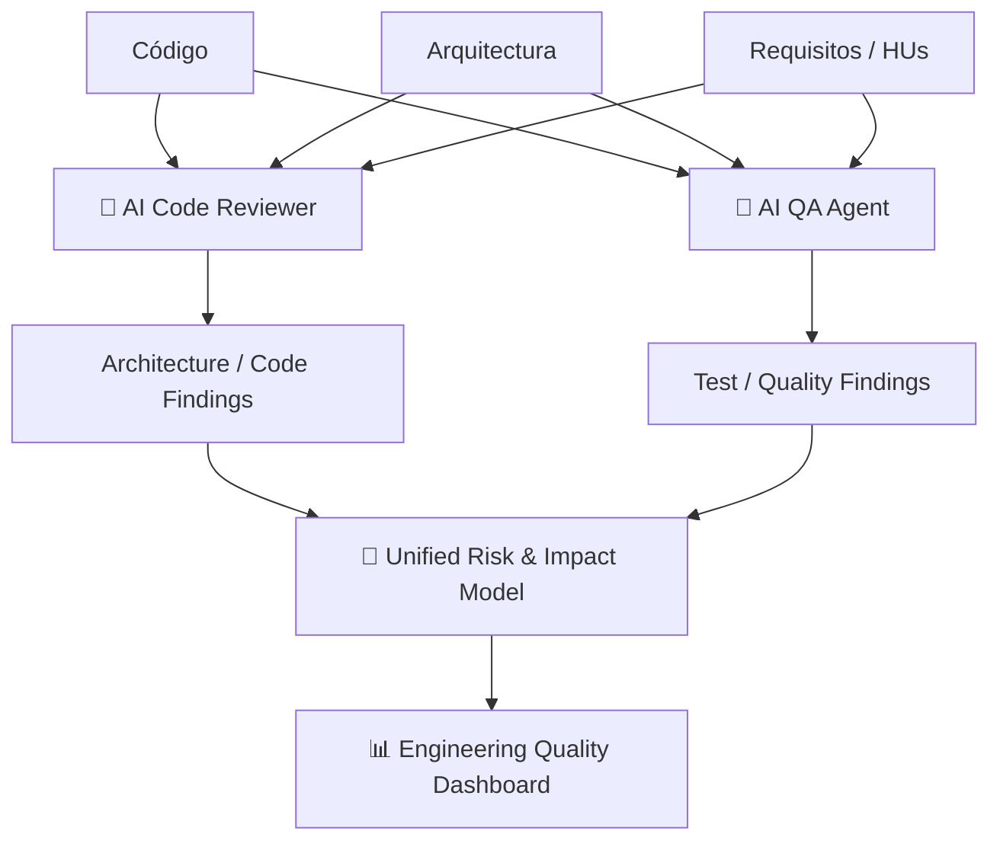

Sí. Para un **agente QA automatizado**, yo cambiaría completamente el enfoque respecto al Code Reviewer.

El Code Reviewer responde:

> **¿El código está bien construido?**

El QA Agent debería responder:

> **¿El sistema cumple lo esperado y qué escenarios/riesgos encontró al probarlo?**

Y, al terminar, además de reportar casos OK/KO, puede generar **diagramas dinámicos basados en las pruebas ejecutadas**.

## 🧪 Los diagramas que mostraría el QA Agent

| Diagrama                           | Qué muestra                                                  | Valor                                |
| ---------------------------------- | ------------------------------------------------------------ | ------------------------------------ |
| **1. Test Execution Flow** ⭐       | Recorrido real de una prueba                                 | Entender qué se probó                |
| **2. Requirements Traceability** ⭐ | HU → criterios → pruebas → resultados                        | Saber qué requisitos están cubiertos |
| **3. Test Coverage Map** ⭐         | Componentes/funcionalidades probadas y no probadas           | Detectar huecos                      |
| **4. Failure Impact Diagram** ⭐⭐⭐  | Fallo → funcionalidad → componentes afectados                | Entender impacto                     |
| **5. User Journey Diagram** ⭐      | Flujo completo desde la perspectiva del usuario              | Validar experiencia end-to-end       |
| **6. API Test Flow**               | Front → API → servicios → DB                                 | Validar integración                  |
| **7. State Transition Diagram**    | Estados y transiciones realmente probados                    | Muy útil para workflows              |
| **8. Test Dependency Graph**       | Dependencias entre pruebas                                   | Detectar pruebas frágiles            |
| **9. Defect Distribution Map**     | Dónde se concentran los defectos                             | Identificar hotspots                 |
| **10. Environment/Test Matrix**    | Qué se probó por navegador, dispositivo, API, ambiente, etc. | Visibilidad de cobertura             |

---

# ⭐ 1. Requirements → Test Traceability

Este probablemente sería **el principal diagrama del QA Agent**.

Por ejemplo:



Y el agente podría mostrar:

```text
HU-001 Registrar cliente

Criterios de aceptación: 3
Casos de prueba:          5
Ejecutados:               5
Exitosos:                 4
Fallidos:                 1

Cobertura funcional: 100%
```

Esto conecta directamente con tu enfoque de **HU + criterios de aceptación + QA**.

---

# ⭐ 2. Test Coverage Map

Este es diferente al coverage tradicional de código.

El QA Agent podría mostrar:



Y detectar:

```text
Autenticación    ██████████  95%
Clientes         ██████████ 100%
Pedidos          █████████░  82%
Pagos            ███░░░░░░░  35%
Reportes         ░░░░░░░░░░   0%
```

Pero lo interesante es que el agente puede combinar:

**requisito + funcionalidad + código + pruebas**

para detectar zonas que aparentemente existen pero **no están realmente probadas**.

---

# ⭐⭐⭐ 3. Failure Impact Diagram

Este sería uno de los diagramas más interesantes.

Supongamos que falla:

> `TC-042 - Registrar pago con tarjeta`

El agente puede generar:



Y el resultado:

```text
❌ TEST FALLIDO

Funcionalidad: Pago
HU afectada: HU-023
Criterio: CA-04

Componentes involucrados:
• PaymentController
• PaymentService
• Payment Gateway
• Payments DB

Funcionalidades potencialmente afectadas:
• Checkout
• Orden
• Facturación
```

Eso ya no es simplemente un reporte de testing.

Es **impact analysis generado por QA**.

---

# ⭐ 4. User Journey Diagram

Para aplicaciones web es muy bueno.

Por ejemplo:



El agente podría mostrar:

```text
User Journey: Registrar Cliente

✅ Login
✅ Dashboard
✅ Clientes
✅ Nuevo cliente
❌ Validación DNI
⏸ Confirmación
⏸ Registro
```

Esto permite visualizar **exactamente dónde se rompe el journey**.

---

# ⭐ 5. State Transition Diagram

Este es especialmente importante cuando tienes estados.

Por ejemplo, para una HU:



El QA Agent puede analizar las pruebas y generar:

```text
Borrador → Enviado       ✅
Enviado → Aceptado       ✅
Enviado → Rechazado      ✅
Rechazado → Borrador     ❌ NO PROBADO
```

Esto es muchísimo más útil que simplemente decir:

> "Cobertura 75%".

Porque muestra **qué transición falta**.

---

# ⭐ 6. API Test Flow

Como tienes Frontend + Backend, este sería importante:



Y puede indicar dónde falló:

```text
Frontend       ✅
API            ✅
Service        ✅
Database       ❌
Respuesta      ❌
```

---

# ⭐ 7. Test Dependency Graph

Este es más propio de un agente automatizado.

Ejemplo:



Si `T1` falla:

```text
⚠️ 4 pruebas dependientes bloqueadas
```

Esto permite distinguir:

```text
❌ Fallos reales
⏸ Pruebas bloqueadas
⚠️ Pruebas inconclusas
```

en lugar de contar todo simplemente como "failed".

---

# ⭐ 8. Defect Hotspot Map

El agente puede descubrir que los errores se concentran en determinadas áreas:



Esto puede cruzarse con:

* cantidad de tests
* cantidad de defectos
* severidad
* frecuencia
* código afectado

y mostrar dónde están los **hotspots de calidad**.

---

# 🏆 Y yo haría que el QA Agent termine así

```text
╔══════════════════════════════════════════════════╗
║              AI QA REVIEW — BUILD #182           ║
╠══════════════════════════════════════════════════╣
║                                                  ║
║  TEST EXECUTION                                  ║
║                                                  ║
║  Tests                    248                    ║
║  Passed                   221                    ║
║  Failed                    12                    ║
║  Blocked                   15                    ║
║                                                  ║
╠══════════════════════════════════════════════════╣
║                                                  ║
║  REQUIREMENTS                                    ║
║                                                  ║
║  HUs analizadas           24                     ║
║  Criterios                87                     ║
║  Criterios cubiertos     81                     ║
║                                                  ║
║  [Requirements Traceability]                    ║
║                                                  ║
╠══════════════════════════════════════════════════╣
║                                                  ║
║  COVERAGE                                        ║
║                                                  ║
║  Functional                93%                    ║
║  API                       96%                    ║
║  E2E                       78%                    ║
║                                                  ║
║  [Test Coverage Map]                             ║
║                                                  ║
╠══════════════════════════════════════════════════╣
║                                                  ║
║  FAILURES                                        ║
║                                                  ║
║  Critical                   1                    ║
║  High                       3                    ║
║  Medium                     6                    ║
║  Low                        2                    ║
║                                                  ║
║  [Failure Impact Diagram]                       ║
║                                                  ║
╠══════════════════════════════════════════════════╣
║                                                  ║
║  FLOWS                                           ║
║                                                  ║
║  [User Journey] [API Flow] [State Transitions] ║
║                                                  ║
╠══════════════════════════════════════════════════╣
║                                                  ║
║  RISK                                            ║
║                                                  ║
║  [Defect Hotspot Map]                            ║
║  [Test Dependency Graph]                         ║
║                                                  ║
╚══════════════════════════════════════════════════╝
```

## 🔥 Pero hay una idea todavía más potente

Si vas a tener **dos agentes**, Code Review y QA, yo haría que compartan información:



Así el **Code Reviewer** descubre:

> "Este código viola la arquitectura."

Mientras que **QA** descubre:

> "Esta funcionalidad falla."

Y un tercer artefacto puede relacionarlos:

> **"Este cambio viola la arquitectura y además afecta una funcionalidad que tiene fallos de prueba."**

Ese **Unified Risk & Impact Diagram** podría ser incluso el diagrama exclusivo del **orquestador/Engineering Quality Agent**, que no pertenecería ni a Frontend, ni Backend, ni QA, ni Code Review.
